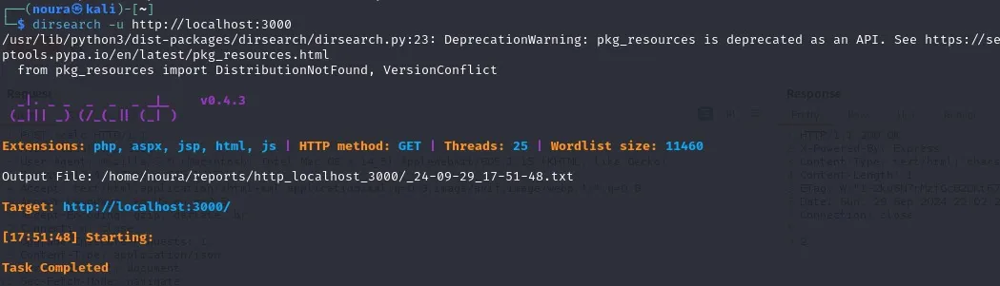
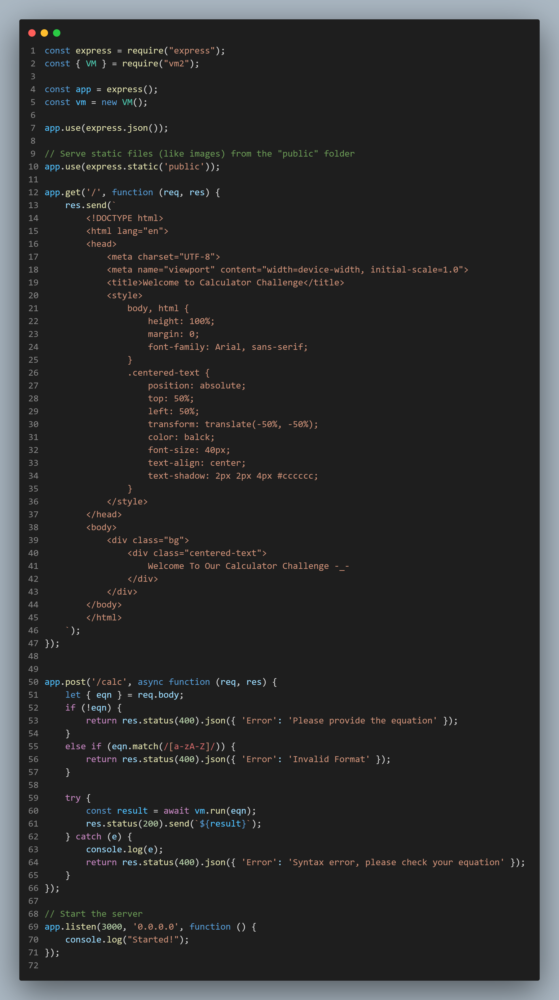
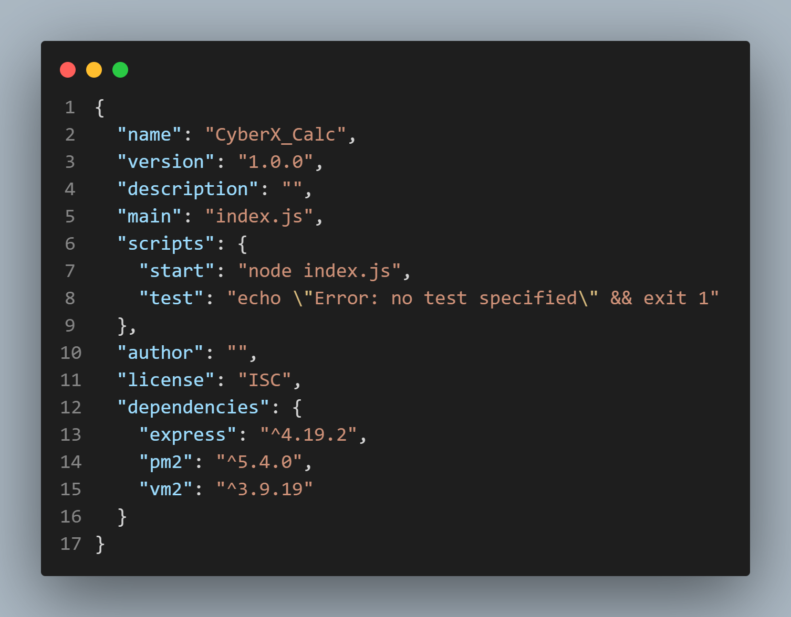
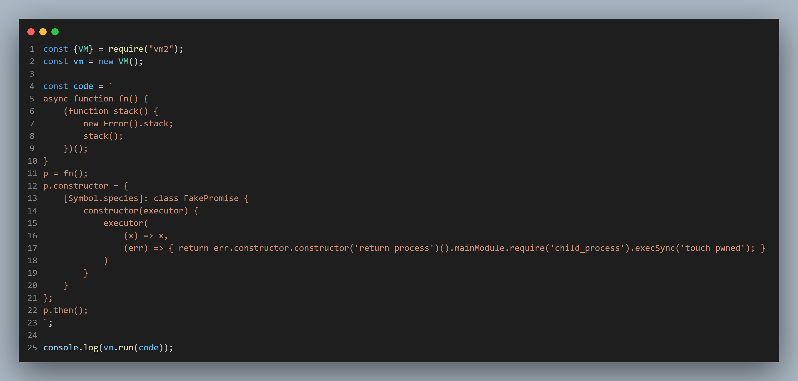
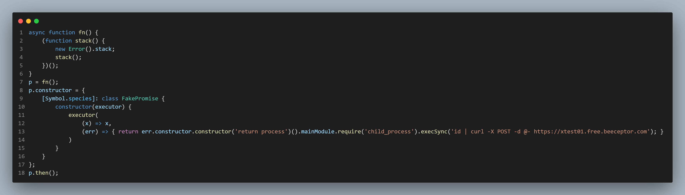

# Secure\_Calc

Secure\_Calc CTF from CyberX\_Internship.

Team Members

-Khaled Ahmed

-Noura Ayman

-Ahmed Farag

-Yousef Fahmy

At first, there are two files you need to download to be able to run the CTF.

I initiated the pentest by fuzzing for potential hidden endpoints using a wordlist to explore the application's directory structure. This was aimed at discovering additional entry points that might not be visible through the regular interface.



After launching my server at `http://localhost:3008/`, I used Burp Suite to capture requests, .experimented by changing the request method and content type, attempting to send various JSON payloads.

Despite my efforts—modifying the method and trying different headers—the responses were consistently **unhelpful :(** . Each attempt to elicit a different response from the server yielded no useful results, but it sharpened my understanding of the application's behavior.

.webp)

realized I needed a deeper dive into how the server was structured. by see source code and get :

**Endpoint Discovery**: By setting up my own `/calc` endpoint and

`{ eqn }` opject , I could test how different endpoints might handle user input, such as equations or other objects

try to catch this end point `http://localhost:3008/calc`

.webp)

now try to modify it

1:change to POST and get

.webp)

When I received a response, I noticed that the `Content-Type` was set to `application/json`. This indicated that the server expected a JSON payload. Based on this, I modified my requests to include a JSON body in the format the server might accept.

and get response :)

.webp)

now try to modify data and see response

.webp)

validation!!!!!

**step back** to index.js code

The code incorporates key validation checks to enhance security:

1. **Missing Equation**: If the `eqn` field is absent in the request, the server responds with a `400 Bad Request` status and an appropriate error message.
2. **Invalid Format**: The server checks for the presence of alphabetic characters in the equation. If any are found, it returns a `400 Bad Request` status with an error indicating an invalid format.



After that, I started using **Postman** and tried several requests from it. doing some math calculations, and I was getting values like in the screenshot.


I tried making some incorrect calculations, but still, nothing changed.

However, I noticed there’s an issue with the power calculations.

For example, 4^2 is supposed to give 16


but it’s showing 6, which is strange. But I thought maybe it’s a problem with the code itself.

So, I went back to analyze the files I had downloaded to understand how the code works, and I started reviewing the

**index.js** file. I found that there’s input protection written like this:

```
[a-zA-Z]
```

This regex means it’s preventing any alphabetic characters from being sent.

I left the **index.js** file and started working on the **package.js** file.

As for the second file,

, I found a few things that surprised me.

It's a page that only contains specific versions that the CTF relies on.



I thought I'd try to see if there's a CVE, for example.

I navigated to the file paths, opened the CMD, and typed

```
npm audit
```

to see if there were any vulnerabilities or issues.


Indeed, I found that the version of VM2

had a vulnerability, so I started investigating the matter.

I searched on Google and found that this CVE is indeed well-known and very dangerous.

It allows me to send code in the request and get a `reverse shell.`

I found a specific Proof of Concept (PoC) and decided to try it out.



However, there was a problem: the request only accepted specific input because a regex was set in the

index.js file.

I couldn’t use the PoC because of that.

As we mentioned, the regex was

```
[a-zA-Z]
```

, so the code couldn’t contain any letters or words to bypass the regex.

I tried encoding in multiple ways, but all of them failed because the output contained letters.

But when I tried using Unicode, the encoding looked like this:

```
\u1234
```


I tried changing the letter "u" to any other letter, and it passed the regex!!!.


I tested all the letters and found that only these passed:

```
r-t-f-b-n
```

. The others didn’t.

Honestly, I didn’t know what to do with those letters, and I couldn't think of any ideas at that moment.

So I thought, why not try encoding using parentheses? I had seen this method before in a write-up, and that's the benefit of reading many write-ups.

I searched again and found that there’s a tool called **JSFuck** that can encode the code in the way you see.


I was very excited and decided to try it.

I tried a normal request to see if it would give me a response or not.

I encoded `7*7`, copied the code, and pasted it into Postman, then sent the request.


The surprise here is that it actually sent me a response of `49`, and that’s when I realized that I had probably made it halfway.

after i found the encode tool worked well so let’s try to encode the POC code and send the request again


The response is changed but what’s the meaning of `[object,object]` after more search i understand the response for this equation is **blind**

.gif)

I used Beeceptor or Burp collaborator to see the response and the command that’s execute on the server is `id`



This code contains several tricks that leverage concepts like `Promises`, `recursive function errors`, and manipulation of the `Promise specification`. The primary goal appears to be executing a malicious command by calling some Node.js methods.

### The Goal of the Code:

The primary purpose is to send information about the user's identity (output of the `id` command) to an external server using **curl**. This type of code is considered **malicious** because it tries to exploit Node.js capabilities to execute system commands and send data to an external server, which is a harmful behavior.

After send this request again by postman and open the beecepter i found this request which show the `uid,gid,etc`


I succeed to gain run code the on server….

.gif)
