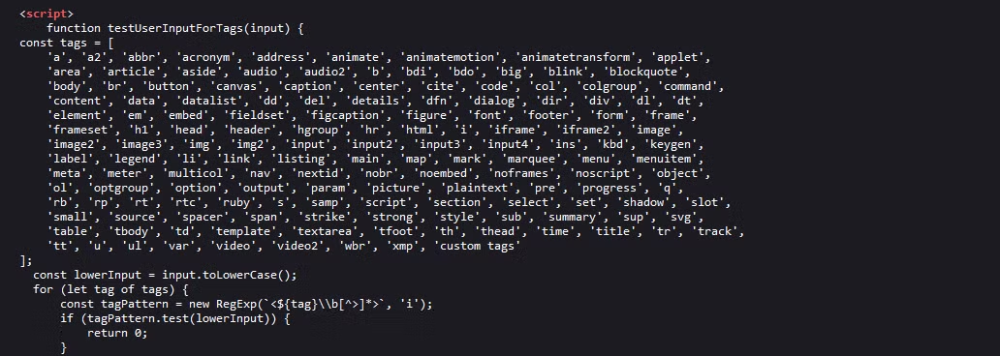
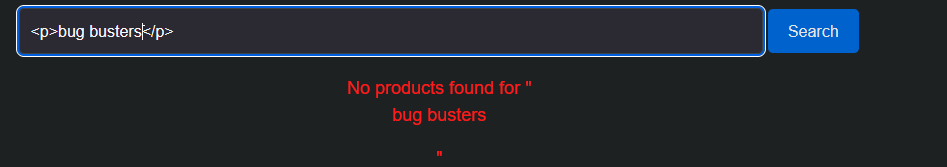
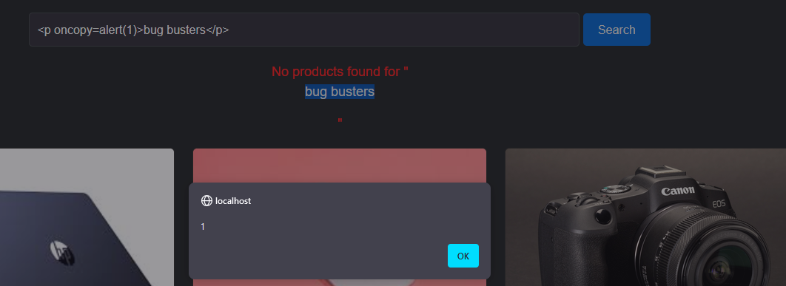

# web app pentest

Hello guys we **Bug Buster** Team ,we will solve this lab today, let's a simulate as a hunter So we have 3 function in this app (login, registration, search)

we have registration and login page so let’s try the SQLi attack

So let’s try to make error to understand how this app work try inject a single quote `(’)` in all parameter for registration

we have this error

<figure><figcaption></figcaption></figure>

From this error we know the type of database is SQL DB

so let’s mitigate this error by add comment or single quote

<figure><figcaption></figcaption></figure>

i try solve this error and i success for do this so let’s try the basic payload who will appear the version for database `union select version()` we don’t found we want

we will try now on the login page maybe this app not have a SQLi vulnerability we will try by this way we used it in registration function

we notice we have the different response from previous

<figure><figcaption></figcaption></figure>

I’m try to encode this comment `--` but i only get the `Query failed` but wait imagine with me how the developer handle query in the backend

the query maybe

```sql
SELECT name,password FROM users WHERE name='$username'AND password='password' 
```

when break this query by single quote it become this

```sql
SELECT name,password FROM users WHERE name='$username'AND password='password''

## what if we don't use comment (-- , #) you can use ' 
SELECT name,password FROM users WHERE name='$username'AND password='password'''
## the query is 100% valed if the developer is block the comment
```

so let’s try this `test''`

<figure><figcaption></figcaption></figure>

Notice : the response transfer from query failed to incorrect name or password

let’s use the name is stored in database and try to login in by `logic query (logic gate)`

try this payload `‘or ‘1’=’1`

<figure><figcaption></figcaption></figure>

<figure><figcaption></figcaption></figure>

let’s think a minute if the comment and or is blocked what if this developer work on this app as a blacklist to filter input so let’s replace or with `||`

<figure><figcaption></figcaption></figure>

We did it, we have SQLi in login page and i succussed to login in any account without password

***

### Search Function

let’s try the XSS in search field, try to write `test` in search filed we will notice it’s reflected in the page

<figure><figcaption></figcaption></figure>

lets test this `bug’<>”/` and show the page source we will find the black list for developer

<figure><figcaption></figcaption></figure>

if we type any of this tags it’s not reflected in page and this request not appear in burp

so what’s if we use the script python it well check if this tag found in the black list or not

[Tag Python Script](https://www.notion.so/Tag-Python-Script-10f1d1e7e13c81d2b310f951895aadee?pvs=21)

we notice the output of this Script is `Missing: p` when we test it in page we notice is reflected in the page

<figure><figcaption></figcaption></figure>

[event python script](https://www.notion.so/event-python-script-10f1d1e7e13c81029f72e53d6812b426?pvs=21)

```
New event: oncopy
New event: onfocus(autofocus)
New event: ontoggle(popover)
```

we notice this event doesn’t exist in black list so let’s exploit when we copy `bug busters` the popup will appear

<figure><figcaption></figcaption></figure>

**We did it !!!**

***

## **mitigation part**

#### Overview of SQL Injection Prevention

To address the SQL injection vulnerability in our application, we initially implemented a **blacklist filter** to sanitize user inputs. This approach aimed to prevent the use of specific keywords and symbols commonly exploited in SQL injection attacks.

#### The Filtering Function

The `isBlackListed()` function was designed to check user inputs against a predefined list of prohibited terms, as illustrated below:

```php
function isBlackListed($parameter) {
    $blackList = [
        "--", ";", "or", "and", "@@", "@", "char", "nchar", "varchar", "nvarchar",
        "table", "alter", "begin", "cast", "create", "cursor", "declare", "delete",
        "drop", "end", "exec", "union", "select", "execute", "fetch", "insert",
        "kill", "open", "sys", "sysobjects", "syscolumns", "update"
    ];
    foreach ($blackList as $blacklistedWord) {
        if (stripos($parameter, $blacklistedWord) !== false) {
            return true; // Parameter contains blacklisted keyword
        }
    }
    return false; // Safe input
}
```

While this filtering function was a step toward securing our application, it became evident that it was not sufficient to fully mitigate the risk of SQL injection. Attackers could potentially bypass the blacklist using various techniques, such as:

* **Bypassing the Blacklist**: An attacker might input a valid SQL command that does not explicitly include any blacklisted keywords but could still manipulate

#### Proposed Mitigation: **Whitelist Approach**

To enhance security and eliminate the possibility of bypassing the blacklist, we propose transitioning to a whitelist validation strategy. This method involves defining acceptable input formats and explicitly allowing only those characters or patterns deemed safe.

For instance, a simple **whitelist function** could look like this:

```php

function isValidInput($input) {
    return preg_match('/^[a-zA-Z0-9]*$/', $input); // **Allow only letters and numbers**
}
```

#### Additional Mitigation Strategies

1.  **Prepared Statements:** Utilize prepared statements to ensure that user input is treated as data, not executable code. This mitigates SQL injection risks significantly.

    ```php
     code
    $stmt = $con->prepare("SELECT * FROM `tbluser` WHERE UserName = ? AND Password = ?");
    $stmt->bind_param("ss", $Name, $Password);
    $stmt->execute();
    $result = $stmt->get_result();
    ```
2. **Database User Permissions:** Ensure that the database user account used by the application has the minimum permissions necessary to perform its tasks. For example, it should not have permissions to drop tables or execute administrative commands.
3. **Regular Security Audits:** Implement routine security audits and code reviews to identify potential vulnerabilities, ensuring that all security practices are up-to-date.
4.  **Error Handling:** Avoid displaying detailed error messages to users, as they may reveal sensitive information about the database structure.

    ```php
    if (!$result) {
        error_log("Query failed: " . mysqli_error($con)); 
        die("An error occurred. Please try again."); 
    }
    ```

***

## **2:index page    (XSS)**

Initially, we applied a **blacklist** approach to mitigate XSS vulnerabilities in our application. This involved filtering user input by checking for specific harmful HTML tags and event handlers through the following functions:

#### Blacklist Filtering Functions

* **Tag Filtering:**

```jsx
const tags = [
        'a', 'a2', 'abbr', 'acronym', 'address', 'animate', 'animatemotion', 'animatetransform', 'applet',
        'area', 'article', 'aside', 'audio', 'audio2', 'b', 'bdi', 'bdo', 'big', 'blink', 'blockquote',
        'body', 'br', 'button', 'canvas', 'caption', 'center', 'cite', 'code', 'col', 'colgroup', 'command',
        'content', 'data', 'datalist', 'dd', 'del', 'details', 'dfn', 'dialog', 'dir', 'div', 'dl', 'dt',
        'element', 'em', 'embed', 'fieldset', 'figcaption', 'figure', 'font', 'footer', 'form', 'frame',
        'frameset', 'h1', 'head', 'header', 'hgroup', 'hr', 'html', 'i', 'iframe', 'iframe2', 'image',
        'image2', 'image3', 'img', 'img2', 'input', 'input2', 'input3', 'input4', 'ins', 'kbd', 'keygen',
        'label', 'legend', 'li', 'link', 'listing', 'main', 'map', 'mark', 'marquee', 'menu', 'menuitem',
        'meta', 'meter', 'multicol', 'nav', 'nextid', 'nobr', 'noembed', 'noframes', 'noscript', 'object',
        'ol', 'optgroup', 'option', 'output', 'param', 'picture', 'plaintext', 'pre', 'progress', 'q',
        'rb', 'rp', 'rt', 'rtc', 'ruby', 's', 'samp', 'script', 'section', 'select', 'set', 'shadow', 'slot',
        'small', 'source', 'spacer', 'span', 'strike', 'strong', 'style', 'sub', 'summary', 'sup', 'svg',
        'table', 'tbody', 'td', 'template', 'textarea', 'tfoot', 'th', 'thead', 'time', 'title', 'tr', 'track',
        'tt', 'u', 'ul', 'var', 'video', 'video2', 'wbr', 'xmp', 'custom tags'
    ];
```

* **Event Filtering:**

```jsx
function testUserInputForEvents(input) {
    const events = [
        'onafterprint', 'onafterscriptexecute', 'onanimationcancel', 'onanimationend', 'onanimationiteration',
        'onanimationstart', 'onauxclick', 'onbeforecopy', 'onbeforecut', 'onbeforeinput', 'onbeforeprint',
        'onbeforescriptexecute', 'onbeforetoggle', 'onbeforeunload', 'onbegin', 'onblur', 'oncanplay',
        'oncanplaythrough', 'onchange', 'onclick', 'onclose', 'oncontextmenu', 'oncuechange', 
        'oncut', 'ondblclick', 'ondrag', 'ondragend', 'ondragenter', 'ondragexit', 'ondragleave', 'ondragover', 
        'ondragstart', 'ondrop', 'ondurationchange', 'onend', 'onended', 'onerror', 'onfocus', 'onfocusin', 
        'onfocusout', 'onformdata', 'onfullscreenchange', 'onhashchange', 'oninput', 'oninvalid', 'onkeydown', 
        'onkeypress', 'onkeyup', 'onload', 'onloadeddata', 'onloadedmetadata', 'onloadstart', 'onmessage', 
        'onmousedown', 'onmouseenter', 'onmouseleave', 'onmousemove', 'onmouseout', 'onmouseover', 'onmouseup', 
        'onmousewheel', 'onmozfullscreenchange', 'onpagehide', 'onpageshow', 'onpaste', 'onpause', 'onplay', 
        'onplaying', 'onpointercancel', 'onpointerdown', 'onpointerenter', 'onpointerleave', 'onpointermove', 
        'onpointerout', 'onpointerover', 'onpointerrawupdate', 'onpointerup', 'onpopstate', 'onprogress', 
        'onratechange', 'onrepeat', 'onreset', 'onresize', 'onscroll', 'onscrollend', 'onsearch', 'onseeked', 
        'onseeking', 'onselect', 'onselectionchange', 'onselectstart', 'onshow', 'onsubmit', 'onsuspend', 
        'ontimeupdate', 'ontoggle', 'ontouchend', 'ontouchmove', 'ontouchstart', 'ontransitioncancel', 
        'ontransitionend', 'ontransitionrun', 'ontransitionstart', 'onunhandledrejection', 'onunload', 
        'onvolumechange', 'onwebkitanimationend', 'onwebkitanimationiteration', 'onwebkitanimationstart', 
        'onwebkitmouseforcechanged', 'onwebkitmouseforcedown', 'onwebkitmouseforceup', 'onwebkitmouseforcewillbegin', 
        'onwebkitplaybacktargetavailabilitychanged', 'onwebkittransitionend', 'onwebkitwillrevealbottom', 'onwheel'
    ];
```

Despite implementing these filters, we discovered that our application remained vulnerable to XSS attacks. Attackers could bypass the blacklist by using various encoding methods or inserting alternative payloads that did not contain the blacklisted keywords.

#### Transitioning to a Whitelist Approach

To enhance security, we adopted a **whitelist** approach, allowing only specific safe HTML tags and attributes. This method significantly reduces the risk of XSS attacks by ensuring that only known safe inputs are processed.

#### Whitelist Implementation

Here’s an example of a whitelist function that sanitizes user input:

```jsx
function sanitizeInput(input) {
    const allowedTags = ['b', 'i', 'em', 'strong', 'p']; // Allowed tags
    const tempDiv = document.createElement('div');
    tempDiv.innerHTML = input;

    // Remove disallowed tags
    for (let tag of tempDiv.getElementsByTagName('*')) {
        if (!allowedTags.includes(tag.nodeName.toLowerCase())) {
            tag.parentNode.removeChild(tag);
        }
    }

    return tempDiv.innerHTML; // Return sanitized HTML
}
```

#### Additional Mitigation Strategies

In addition to switching to a whitelist approach, we can further enhance security through the following measures:

1.  **Output Encoding:** Use output encoding libraries to ensure that any user input displayed in the browser is properly encoded. This prevents the browser from interpreting it as executable code.

    ```jsx
    function encodeForHTML(input) {
        const element = document.createElement('div');
        element.textContent = input;  
        return element.innerHTML;     
    }

    // Usage example
    const userInput = '<script>alert("XSS")</script>';
    const safeOutput = encodeForHTML(userInput);
    document.getElementById('output').innerHTML = safeOutput; 
    ```
2.  **Content Security Policy (CSP):** Implement a robust CSP to restrict the sources from which scripts can be loaded. This adds an additional layer of protection against XSS attacks.

    In your HTML file, you can add a CSP header like this:

    ```html
    <meta http-equiv="Content-Security-Policy" content="default-src 'self'; script-src 'self' <https://trustedscripts.example.com>;">

    ```

    This policy allows scripts to be loaded only from the same origin and from a trusted external source, blocking any unauthorized script execution.
3.  **Regular Security Audits:** Conduct regular code reviews and security audits to identify and remediate potential vulnerabilities proactively.

    While regular audits are more about process than code, here’s a simple example of a checklist that can be implemented in code review tools or documentation:

    ```markdown
    markdown
    Copy code
    ## Security Audit Checklist
    - [ ] Validate and sanitize all user inputs
    - [ ] Implement output encoding for displayed data
    - [ ] Use prepared statements for SQL queries
    - [ ] Apply a Content Security Policy (CSP)
    - [ ] Regularly update dependencies to mitigate vulnerabilities
    - [ ] Test for XSS and other vulnerabilities using automated tools

    ```
