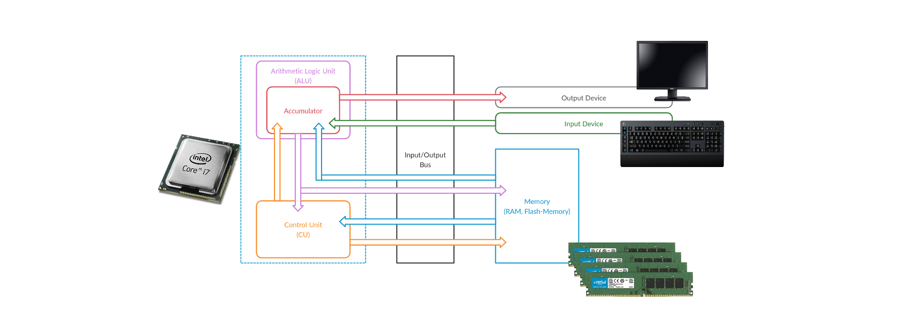

# Intro to Buffer Overflow

A **buffer** is simply **a space in memory designed to hold a fixed amount of information**. This information can be a string. An example of a string is a sentence like, “Hello, world!

**can occur in program language like C,C++ and IOT/Embed system**

popular CVE : CVE-2017-12542 , CVE-2021-315

***

**main types** of exploits:

1. **0-Day Exploits** – Target unknown vulnerabilities that haven't been patched.
2. **N-Day Exploits** – Target known vulnerabilities before they are fixed.

Exploits are categorized into:

* **Local Exploits:** Require local access to escalate privileges.
* **Remote Exploits:** Work over a network, often using `buffer overflow techniques.`
* **DoS Exploits:** Disrupt services by crashing software or overloading resources.
* **WebApp Exploits:** Target web applications via command injection, SQL injection, etc.

***

.png>)

### **CPU Architecture**

* `Memory`
* `Control Unit`
* `Arithmetical Logical Unit (ALU)`
* `Input/Output Unit`

***

<figure><figcaption></figcaption></figure>

**EBP** → refer to bottom of stack

ESP → refer to Top of stack

**Stack** →work on LIFO (last in first out)

***

**how code execute**

<figure><figcaption></figcaption></figure>

***

**Debugger** → tool like burp suite work between computer and server which can edit code

<figure><figcaption></figcaption></figure>
