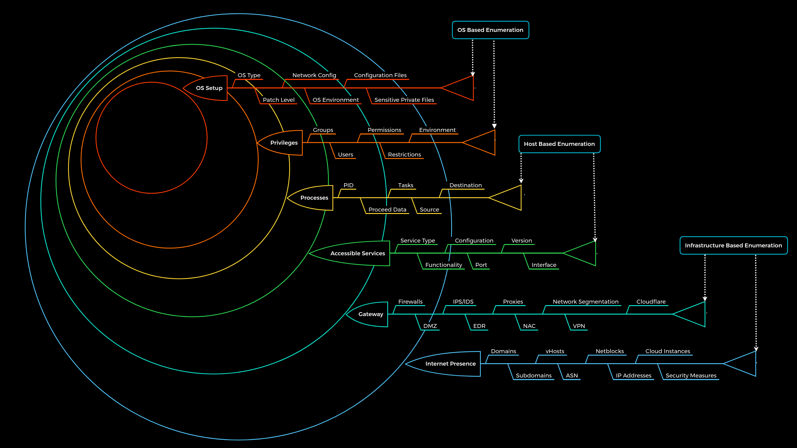
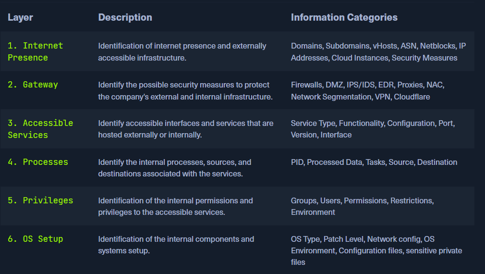

# Intoduction

## **Reconnaissance** Vs **Enumeration**&#x20;

### **Reconnaissance**&#x20;

is the initial, broad info-gathering phase (e.g., finding IPs or domains)

**Enumeration**&#x20;

is a deeper, active step to extract specific details (e.g., usernames or services) after reconnaissance.

*   **Enumeration**

    Enumeration is the process of gathering information about a target using **active methods** (like scanning) and **passive methods** (like OSINT). However, **OSINT is separate from enumeration** because it relies only on publicly available data without direct interaction with the target.

    Enumeration is an **iterative process**, meaning you continuously gather more information based on what you already know.

    The main goal is to **understand the target's infrastructure** rather than blindly attacking it. Many testers make the mistake of immediately brute-forcing authentication services (SSH, RDP, WinRM), which is a **noisy approach** that can get them blacklisted. Instead, a smarter approach is to first analyze the company's setup, security measures, and services before launching attacks

## **Enumeration Methodology**

<figure><figcaption></figcaption></figure>

<figure><figcaption></figcaption></figure>

## **How to identify a company's online presence?**

1. use SSL certificate to collect subdomains
2.  [crt.sh](https://crt.sh/). This source is [Certificate Transparency](https://en.wikipedia.org/wiki/Certificate_Transparency) logs, which SSL certificate is assigned in audit-proof logs

    <figure><figcaption></figcaption></figure>

    ```bash
    # use to filter unique subdomain
    curl -s <https://crt.sh/\\?q\\=inlanefreight.com\\&output\\=json> | jq . | grep name | cut -d":" -f2 | grep -v "CN=" | cut -d'"' -f2 | awk '{gsub(/\\\\n/,"\\n");}1;' | sort -u

    ```
3.  Shodan - IP List

    ```bash
    # extract IPs
    for i in $(cat subdomainlist);do host $i | grep "has address" | grep inlanefreight.com | cut -d" " -f4 >> ip-addresses.txt;done
    ```

    ```bash
    # search in shodan using IPs
    for i in $(cat ip-addresses.txt);do shodan host $i;done

    ##to add API key
    shodan init API_KEY

    ```
4.  DNS Records

    dig tool

    ```bash
    dig +noall +answer google.com NS # to get the DNS server
    dig +noall +answer google.com TXT # Some records may include verification keys for third-party services (e.g., Google, Microsoft).
    dig +noall +answer microsoft.com A # to get ipv4 address
    dig +noall +answer microsoft.com MX # mail server
    dig +noall +answer microsoft.com CNAME # alias names
    dig +noall +answer microsoft.com AAAA # ipv6 
    dig +noall +answer microsoft.com ANY # to get all of the above
    dig +noall +answer @spacific_DNS_Server microsoft.com ANY # to search in specific dns server

    ```

    dnsrecon tool

    ```bash
    dnsrecon -d microsfot.com 
    dnsrecon -d microsfot.com -n specific_dns_server 
    ```

*   **Cloud Resources**

    * **Publicly accessible storage (S3, Blobs, Cloud Storage)** can expose **sensitive data** if left open.
    * **S3 Buckets** → AWS
    * **Blobs** → Azure
    * **Cloud Storage** → GCP

    When testing a company's **hosted servers and cloud resources**, we check **subdomains and IP addresses** using commands like:

    ```bash
    ## for search each service is locally or upload on cloud
    for i in $(cat subdomainlist);do host $i | grep "has address" | grep inlanefreight.com | cut -d" " -f1,4;done
    ```

    💡 **Findings:**

    * Some **IP addresses belong to internal servers**
    * Others are **cloud services like AWS S3**

    🚨 **Security Risk:**

    * If **S3 buckets** are misconfigured, anyone **can access stored files**
    * **Google Dorks** (e.g., `inurl:s3.amazonaws.com intext:"confidential"`) can help find **exposed cloud storage**

    **use to search on bucket** : [https://buckets.grayhatwarfare.com/buckets](https://buckets.grayhatwarfare.com/buckets)
*   **Staff**

    search on LinkedIn or any sites offer jobs
