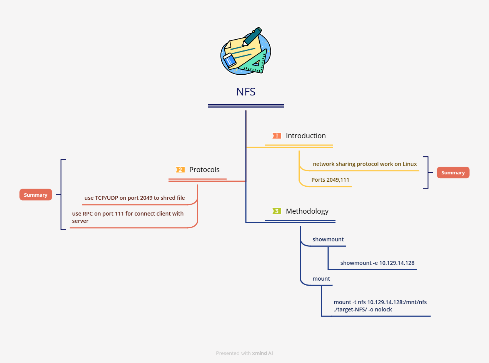

# NFS

<mark style="color:red;">**NFS (Network File System)**</mark> is a file-sharing protocol developed by **Sun Microsystems** to allow Linux/Unix systems to access remote files **as if they were local**.

<mark style="color:red;">**Key Differences from SMB:**</mark>

* **NFS is for Linux/Unix**, while **SMB is mainly for Windows**.
* **Older NFS versions authenticate devices**, while **SMB always requires user authentication**.
* **NFSv4+ includes security features like Kerberos & ACLs**.

<mark style="color:red;">**NFS Versions:**</mark>

* **NFSv2** (UDP-based, outdated but still supported).
* **NFSv3** (Supports larger files, better error handling).
* **NFSv4** (Stateful, supports Kerberos & ACLs).
* **NFSv4.1** (Adds **pNFS** for parallel access & multipathing).

**FS uses ONC-RPC (SUN-RPC) over TCP/UDP (port 111) and relies on XDR for cross-system data exchange.**

<mark style="color:red;">**Does NFS have built-in authentication or authorization?**</mark>

* **❌ No built-in authentication in NFS itself**; it relies on **RPC authentication.**
* **✅ Authorization depends on UNIX file system permissions (UID/GID).**

<mark style="color:red;">**To use NFS (Network File System), you need to open these ports:**</mark>

* **TCP/UDP port 2049**: The main port NFS uses to transfer files (TCP for reliability, UDP for speed).
* **TCP/UDP port 111**: Used by RPC to connect clients to the server.

***

#### **Foot printing**

```bash
nmap -sV -A -p 111,2049 10.129.14.128 
```

**NFS scripts** → This lets us check whether the target share is connected to the network on all required ports.

```bash
nmap --script nfs* 10.129.14.128 -sV -p 111,2049
```

<figure><figcaption></figcaption></figure>

Once an **NFS** service is found, we can mount it on our local machine to access shared files.

**Steps to mount an NFS share:**

1️⃣ **Check available shares:**

```bash
showmount -e 10.129.14.128
```

<figure><figcaption></figcaption></figure>

2️⃣ **Create a local mount point:**

```bash
mkdir target-NFS
sudo mount -t nfs 10.129.14.128:/mnt/nfs ./target-NFS/ -o nolock
cd target-NFS
tree .
```

<figure><figcaption></figcaption></figure>

<figure><figcaption></figcaption></figure>

Link : [https://xmind.ai/share/0eMXX17N?xid=wUvu00kk](https://xmind.ai/share/0eMXX17N?xid=wUvu00kk)
