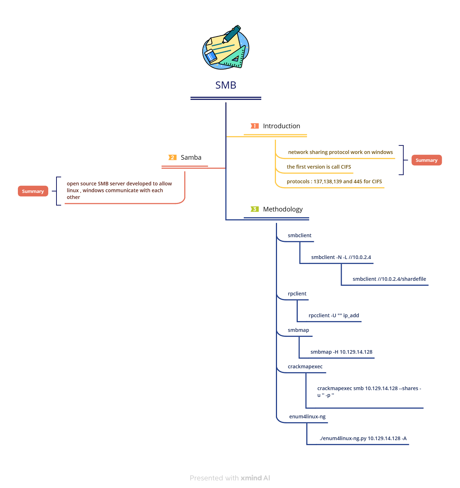

# SMB & Netbios Enumeration

#### **SMB (Server Message Block)**

SMB is a network sharing protocol widely used for file, printer, and resource sharing in Windows networks. It allows users to access files on remote systems as if they were local.

SMB Versions:

* **SMB 1.0**: Early versions were prone to security issues and are now largely deprecated.
* **SMB 2.0/2.1**: Introduced in Windows Vista/Server 2008, with improved security and performance.
* **SMB 3.0**: Added in Windows 8/Server 2012, with features like encryption and multichannel support.

**Ports**: SMB operates over port 445 for direct connections, while port 139 is used for NetBIOS integration.

**Modern networks often rely on SMB with DNS, with NetBIOS being optional or enabled for backward compatibility.**

🔹 **How it Works:**

* A **client** connects to an **SMB server** to access shared files/services.
* It operates over **TCP** and establishes connections using a **3-way handshake**.
* Access permissions are controlled by **ACLs (Access Control Lists)** for fine-grained control.

***

**Samba and CIFS Protocol Summary in English**

🔹 **What is Samba?**

**Samba** is an **open-source SMB server** for **Linux and Unix**, allowing them to communicate with **Windows** systems over a network.

🔹 **What is CIFS?**

* **CIFS (Common Internet File System)** is an **older SMB version** developed by **Microsoft**.
* It primarily works with **SMB 1**, whereas newer versions like **SMB 2 & SMB 3** offer better performance and security.
* **CIFS uses TCP port 445**, while **NetBIOS SMB uses ports 137, 138, and 139**.

***

```bash
# use to restart Samba
sudo systemctl restart smbd
```

**Exploring SMB Shares with `smbclient`**

We can list available shares on an SMB server using a **Null Session** (anonymous access) with the following command:

```bash
smbclient -N -L //10.129.14.128 
```

**📌 Explanation:**

* `N` → No password (anonymous login).
* `L //10.129.14.128` → List available shares on the target server.

**Sample Output:**

```bash
Sharename       Type      Comment
---------       ----      -------
IPC$            IPC       Remote IPC
ADMIN$          Disk      Remote Admin
C$              Disk      Default share
notes           Disk      Personal Notes
```

to access share file

```bash
smbclient //10.129.14.128/notes # added name of file
```

to run command on **samba** we use **`!`**

```bash
smb: \\> !cat test.txt
```

***

**Monitoring Samba Connections with `smbstatus`**

The `smbstatus` command helps administrators track active connections on a Samba server. It provides details about:

* **Connected users**
* **Machines accessing the server**
* **Samba version**
* **Active SMB protocol version**

📌 **Example Output:**

```bash
Samba version 4.15.0
PID     Username      Group        Machine             Protocol Version
------------------------------------------------------------------------
2103    alice         users        192.168.1.10        SMB3_02
2207    bob           admins       192.168.1.15        SMB3_11
```

***

**Footprinting the service**

```bash
sudo nmap 10.129.14.128 -sV -sC -p139,445
```

**Why use `rpcclient` instead of Nmap?**

```bash
rpcclient -U "" ip_add
```

Nmap may not reveal enough SMB information. `rpcclient` is a powerful tool that allows manual interaction with SMB and retrieves details like:

* User accounts
* User groups
* Shared folders and security policies

it depend on **RPC (Remote procedure call)**

**🛠️ Key `rpcclient` commands:**

| **Query**                 | **Description**                                                    |
| ------------------------- | ------------------------------------------------------------------ |
| `srvinfo`                 | Server information.                                                |
| `enumdomains`             | Enumerate all domains that are deployed in the network.            |
| `querydominfo`            | Provides domain, server, and user information of deployed domains. |
| `netshareenumall`         | Enumerates all available shares.                                   |
| `netsharegetinfo <share>` | Provides information about a specific share.                       |
| `enumdomusers`            | Enumerates all domain users.                                       |
| `queryuser <RID>`         | Provides information about a specific user.                        |

**Brute Forcing User RIDs**

```bash
 for i in $(seq 500 1100);do rpcclient -N -U "" 10.129.14.128 -c "queryuser 0x$(printf '%x\\n' $i)" | grep "User Name\\|user_rid\\|group_rid" && echo "";done
```

***

we use `smbmap` and `crackmapexec`

```bash
crackmapexec smb 10.129.14.128 --shares -u '' -p ''

smbmap -H 10.129.14.128
```

enum4linux-ng which this tool use to automate process

```bash
git clone <https://github.com/cddmp/enum4linux-ng.git>
cd enum4linux-ng
pip3 install -r requirements.txt
 ./enum4linux-ng.py 10.129.14.128 -A
```

***

#### **SMB cheat sheet**

<table data-header-hidden><thead><tr><th width="316"></th><th></th></tr></thead><tbody><tr><td><strong>Command</strong></td><td><strong>Description</strong></td></tr><tr><td><code>smbclient -N -L //&#x3C;FQDN/IP></code></td><td>Null session authentication on SMB.</td></tr><tr><td><code>smbclient //&#x3C;FQDN/IP>/&#x3C;share></code></td><td>Connect to a specific SMB share.</td></tr><tr><td><code>rpcclient -U "" &#x3C;FQDN/IP></code></td><td>Interaction with the target using RPC.</td></tr><tr><td><code>samrdump.py &#x3C;FQDN/IP></code></td><td>Username enumeration using Impacket scripts.</td></tr><tr><td><code>smbmap -H &#x3C;FQDN/IP></code></td><td>Enumerating SMB shares.</td></tr><tr><td><code>crackmapexec smb &#x3C;FQDN/IP> --shares -u '' -p ''</code></td><td>Enumerating SMB shares using null session authentication.</td></tr><tr><td><code>enum4linux-ng.py &#x3C;FQDN/IP> -A</code></td><td>SMB enumeration using enum4linux.</td></tr></tbody></table>

***

**Quick Summary**

✅ **Samba** allows Linux/Unix to communicate with Windows using **SMB/CIFS** for file and printer sharing.

✅ **Samba 3** can join **Active Directory**, while **Samba 4** can act as a **Domain Controller (DC)**.

✅ It has two main services: **smbd** (file sharing) and **nmbd** (name resolution with NetBIOS).

✅ Works in **Workgroup** (small networks) or **Active Directory** (large, secure networks).

***

***

#### **NetBIOS (Network Basic Input/Output System)**

NetBIOS is an API and set of network protocols for communication over local networks, allowing applications on different computers to find and interact with each other. NetBIOS offers three primary services:

1. **Name Services**: Facilitates name resolution, allowing devices to register and resolve NetBIOS names over port 137.
2. **Datagram Distribution Services**: Supports connectionless communication, typically over port 138.
3. **Session Services**: Manages connection-oriented communication on port 139 for reliable data transfers.

***

<figure><figcaption></figcaption></figure>

Link : [https://xmind.ai/share/OlDJ7Hxu?xid=D3uFkSl9](https://xmind.ai/share/OlDJ7Hxu?xid=D3uFkSl9)
