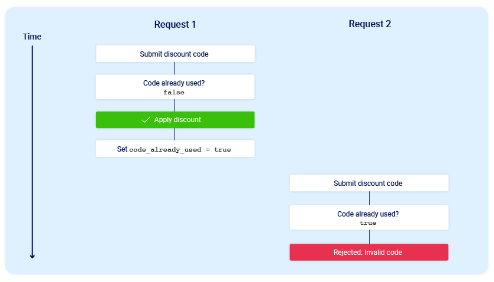
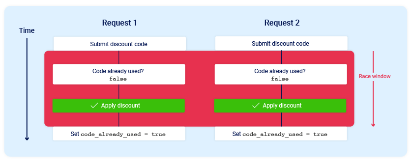

# Race Conditions

## What's the Race Conditions?

> send many request in the same second or more one operation occurs at the same time or requests concurrently without adequate safeguards

Result of Race Condition : **`Collusion`** that causes unintended behavior in the application

```visual-basic
to send request by repeater -> right click on the number of request and choose create group
 then click ctrl+R then choose any request of group and choose send group in parallel
```

the aim of `Race Condition` is : exceed some kind of limit imposed by the business logic of the application

send two request

<figure><figcaption></figcaption></figure>

send two request by race condition

<figure><figcaption></figcaption></figure>

***

## We can found this vulnerability in

1. gift-card or promo code , etc
2. change email or anything like this
3. rating a product multiple times, add comments
4. transferring cash in excess of your account balance
5. Reusing a single CAPTCHA solution
6. Bypassing an anti-brute-force rate limit
